# 理论篇: Swift/ObjC 语言基础

<p align="center"><a href="https://github.com/ChenYilong/iOSInterviewQuestions/blob/master/02_Swift_interview_questions/practical.md"></a></p>

Swift面试题共分为两篇:

- [《理论篇: Swift/ObjC 语言基础》](https://github.com/ChenYilong/iOSInterviewQuestions/blob/master/02_Swift_interview_questions/theory.md) 
 - [《实战篇: iOS项目开发技能》]( https://github.com/ChenYilong/iOSInterviewQuestions/blob/master/02_Swift_interview_questions/practical.md ) 

 是我自己在国外面试时准备的笔记, 所以很多是英文的, 后续有时间再翻译. 

# 目录

## 初级面试题

## 代码优化题

1. 优化判断题
2. 代码优化

## 数据类型与结构

- WHY Swift not ObjC?
- 介绍一下 Swift 相关的重要变更事件
- What is the difference between a struct and a class? 请比较 Swift 中的结构体和类的主要区别？class 和 struct 的区别.
- Q: if a struct is an immutable value type, why we can mutate the size property?
- Swift 的 Copy-on-Write 是怎么实现的
- What are the basic categories of types in Swift?
- What is a Tuple in Swift?
- Is it possible to return multiple values from a function in Swift? If yes, how?
- final 是什么：
- String 与 NSString 的关系与区别：
- defer 使⽤场景：
- struct 在堆区还是栈区？
- 属性中，值属性，和计算属性有什么区别？
- 声明⼀个只有⼀个参数没有返回值闭包的别名
-  Principle of Dictionary?

## **泛型：**

- Q.什么是泛型，swift哪些地方使用了泛型？
- Have you used generics in Swift?
- 请解释 Swift 中的泛型是什么？并描述一下它的本质？
- *泛型的本质*
-  What's the difference between `opaque type` and `generic`?


## 内存管理、**性能优化和调试：**

- When do you use static variables in Swift?static 关键字和 class 关键字 修饰的类⽅法有什么区别？
- Can you explain the difference between weak and unowned references in Swift?
- What is memory leak ? how to solve?

## 数据处理、语言安全、 **访问权限：**

- Please implement a convenience init method for a subclass.
- Swift 的安全性
- 请解释 Swift 中的访问权限如何设置，以及不同访问级别之间的区别？
- Swift Try catch 的原理？
- Swift 的计算属性、存储属性、懒加载
- How do you filter an array of instances to extract a specific property?
- The time complexity of the map, filter, and reduce?
- *Sequence / ⾼阶函数 / Collection*
- 混编过程中遇到的 Crash

## 面向对象

- Swift 对象和 OC 对象的区别
- What is polymorphism?
- 不通过继承，代码复⽤ / 共享的⽅式有哪些？
- 父类的分类中写了一个方法, 子类能否直接调用。告知原因。

## **面向协议编程：**

- What is a protocol and how can we benefit from it?
- Can we add a property in a protocol? Can we put property in the protocol in Swift? And can we share the same property value through protocol in Swift?
- 请描述什么是面向协议编程（Protocol-oriented Programming），并举例说明其在Swift中如何实现？
- Swift 的协议和 OC 的协议有什么区别
- **What is protocol extension? Why Swift called as Protocol Oriented Language?**

## **闭包：**

- Have you worked with closures in Swift?
- When would you use a closure?
- What are closures in Swift?
- 请解释 Swift 中的闭包是什么，并描述一个闭包在实际编程中的应用场景？
- Swift 的闭包（Closure） 和 OC 的 Block
- 请解释 Swift 中的闭包是什么，并描述一个闭包在实际编程中的应用场景？


## **可选类型：**

- What are the ways to unwrap an optional value in Swift?
- How do you unwrap optionals?
- Swift 中的可选型是什么？它的本质是什么？
- What is the difference between if let and guard let?
- *Optional（可选型） 是⽤什么实现的*

## **lazy 关键字：**

- 请解释 Swift 中的 lazy 关键字是怎么实现的？在什么情况下会使用它？
- *lazy load 是怎么实现的？*

# 正文

## 初级面试题
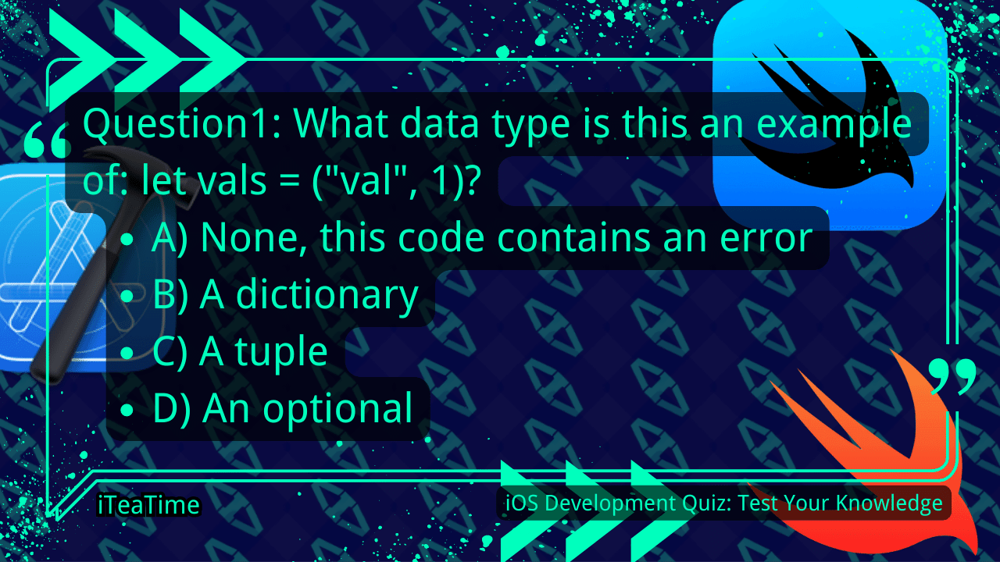

Answer: C

A tuple in Swift is defined as: let vals = 
("val", 1)


A valid dictionary in Swift should be defined as: let vals = ["val": 1]

A valid set in Swift should be defined as: let vals: Set = ["val", "1"]


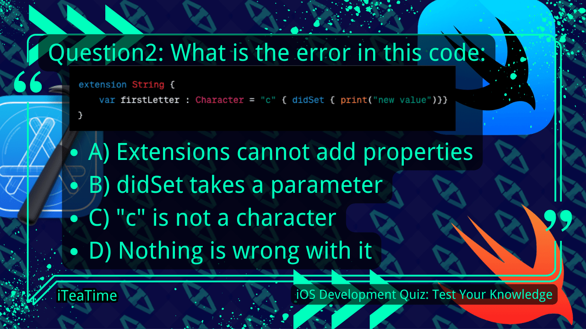


**Answer:** A) Extensions cannot add properties. In Swift, extensions can add computed instance properties and computed type properties, but they cannot add stored instance properties, or property observers such as `willSet` and `didSet`. Therefore, the code snippet you provided is incorrect. 

A corrected version using computed properties could look like this:
```swift
extension String {
    var firstLetter : Character {
        get {
            return self.count > 0 ? self[self.startIndex] : nil
        }
        set {
            // Replace first character of string, or add if none exists
            if self.count > 0 {
                self.replaceSubrange(self.startIndex...self.startIndex, with: String(newValue))
            } else {
                self.append(newValue)
            }
        }
    }
}
```


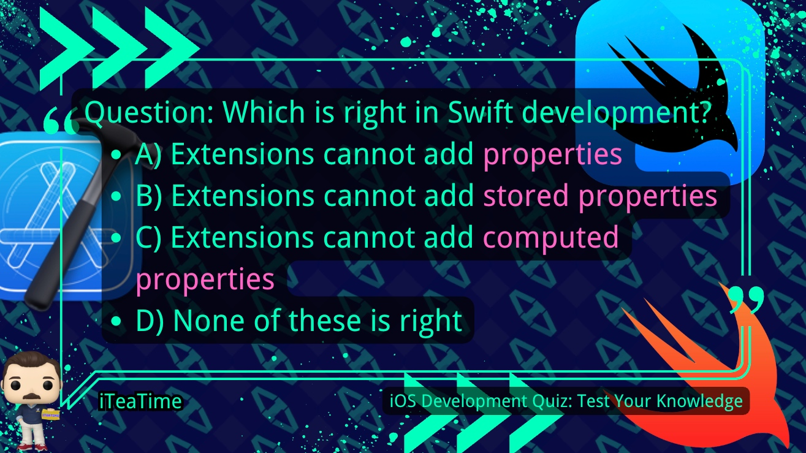

Answer: B.

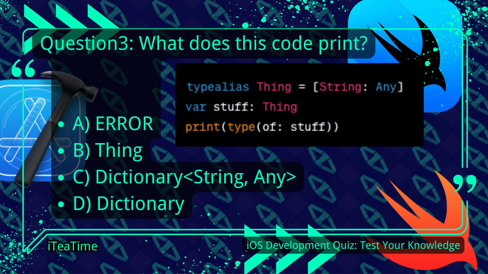

**Answer:** C) Dictionary<String, Any>


In Swift, when you define a `typealias`, it creates a new name for an existing type. However, when you print the type using `type(of:)`, it shows the original type, not the typealias name.

but it is better to write the code in this way:

```swift
typealias Thing = [String: Any]
var stuff: Thing = [:]
print(type(of: stuff))
```

it is better to init the stuff before you use it, but it won't be a big problem.

The output will indeed be `Dictionary<String, Any>`. The `type(of:)` function will print the actual type of `stuff`, which is `Dictionary<String, Any>`, not the `typealias` name `Thing`. 


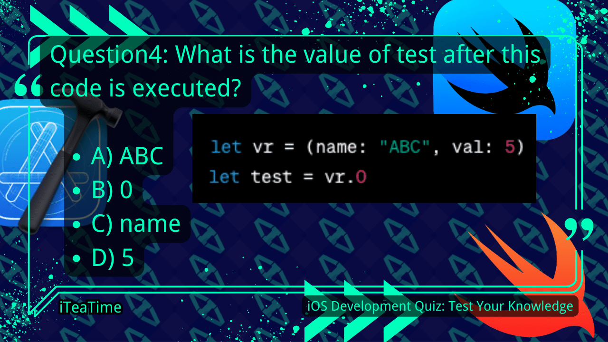

**Answer:** A) ABC. After executing the code, the value of `test` will be "ABC". The variable `vr` is defined as a tuple with named elements. The tuple has two elements: `name` and `val`. In Swift, you can access tuple elements using dot syntax followed by the index of the element. The first element in a tuple has an index of 0, the second element has an index of 1, and so on. In this case, `vr.0` refers to the first element of the tuple, which is `"ABC"`. Therefore, the value of `test` will be `"ABC"`.


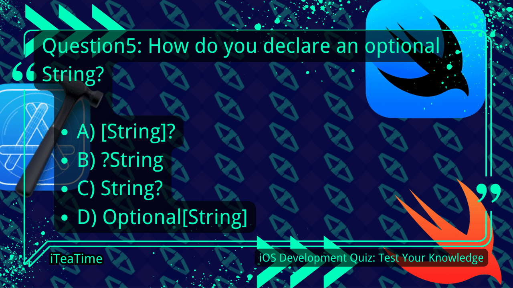


**Answer:** C) string?. To declare an optional String in Swift, you use the syntax `String?`. The question mark `?` indicates that the variable can either contain a String value or be `nil`, which means it is optional. For example:
```swift
var optionalString: String?
```
In this case, `optionalString` is an optional variable that can hold a String value or be `nil`.


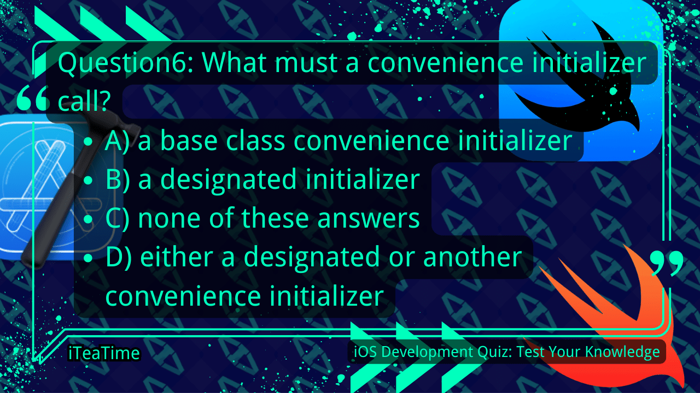


**Answer:** D) either a designated or another convenience initializer. In Swift, a convenience initializer must call another initializer within the same class, whether it is a designated initializer or another convenience initializer. It ensures that the complete initialization chain is followed, allowing the designated initializer at the top of the chain to initialize all properties.

To clarify, the designated initializer is the primary initializer responsible for initializing all properties of a class, and it must eventually call a designated initializer from its superclass to ensure all properties throughout the inheritance chain are initialized.

On the other hand, convenience initializers are secondary initializers that provide additional ways to create an instance. They must call a designated initializer or another convenience initializer from the same class before customizing the instance if needed. This guarantees that all properties are initialized properly regardless of the initializer used to create the instance.


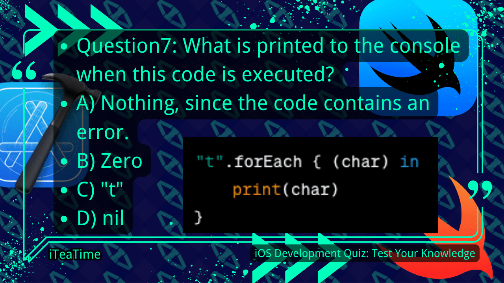
The correct answer is:

**Answer:** C) "t"

When the provided Swift code is executed, it will iterate over each character in the string "t" using the `forEach` method. The closure `{ (char) in print(char) }` is called for each character, and it will print each character to the console. In this case, there's only one character in the string, which is "t", so "t" will be printed to the console.

Output:
```
t
```


**Answer:** B) Protocol functions cannot have implementations. The code is incorrect because protocol functions cannot have default implementations. Protocols are used to define a set of methods or properties that must be implemented by conforming classes or structures. However, protocol functions cannot provide a default implementation within the protocol definition itself.

To fix the code, remove the implementation of the `add` function from the protocol definition, like this:
```swift
protocol iTeaTime {
    func add(x1: Int, x2: Int) -> Int
}
```
Now, any class or structure that conforms to the `iTeaTime` protocol will be required to provide its own implementation of the `add` function.


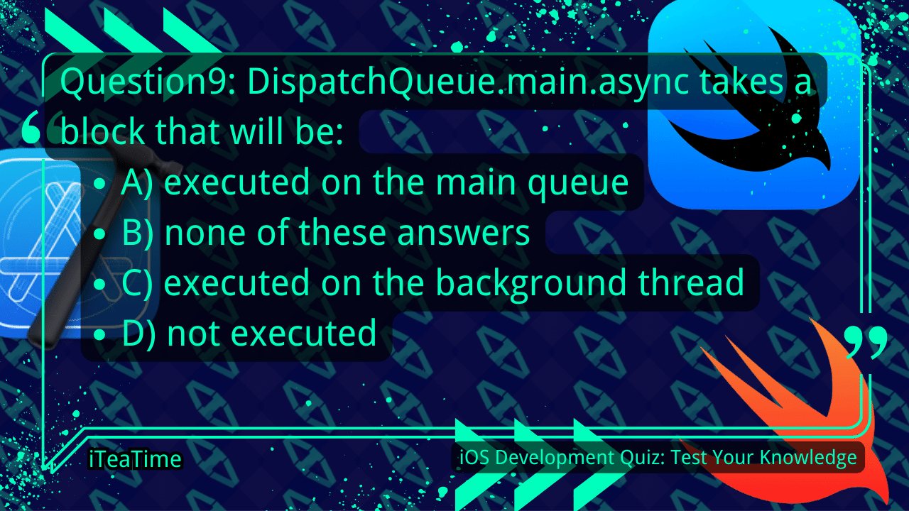

**Answer:** A) executed on the main queue. The `DispatchQueue.main.async` method takes a block of code (closure) and schedules it to be executed asynchronously on the main queue. In iOS, the main queue is responsible for handling UI updates and user interactions. By using `DispatchQueue.main.async`, you ensure that the code inside the block will be executed on the main thread, allowing you to safely update the UI elements from that block.

For example:
```swift
DispatchQueue.main.async {
    // Code here will be executed on the main queue
    // You can safely update UI elements from this block
}
```

## 代码优化题

## Q: 代码题:

```
class Person {
    var name: String

    init(name: String) {
        self.name = name
    }
}

struct Company {
    var size: Int
    var manager: Person

    mutating func increaseSize() {
        self = Company(size: size + 1, manager: manager)
    }

    mutating func increaseSizeV2() {
        size += 1
    }
}

var companyA = Company(size: 100, manager: Person(name: "Peter"))

var companyB = companyA
companyA.size = 150  // if a struct is an immutable value type, why we can mutate the size property?
print(companyA.size) // ? question1
print(companyB.size) // ? question2

companyA.manager.name = "Bob"
print(companyA.manager.name) // ? question3
print(companyB.manager.name) // ? question4

companyA.increaseSize()
print(companyA.size) // ? question5
companyA.increaseSizeV2()
print(companyA.size) // ? question6

```

A:

```
class Person {
    var name: String

    init(name: String) {
        self.name = name
    }
}

struct Company {
    var size: Int
    var manager: Person

    mutating func increaseSize() {
        self = Company(size: size + 1, manager: manager)
    }

    mutating func increaseSizeV2() {
        size += 1
    }
}

var companyA = Company(size: 100, manager: Person(name: "Peter"))

var companyB = companyA
companyA.size = 150  // if a struct is an immutable value type, why we can mutate the size property?
print(companyA.size) // ? 150
print(companyB.size) // ? 150

companyA.manager.name = "Bob"
print(companyA.manager.name) // ? Bob
print(companyB.manager.name) // ? Bob

companyA.increaseSize()
print(companyA.size) // ? 151
companyA.increaseSizeV2()
print(companyA.size) // ? 152
```

```

答案

question1:150
question2:100
question3:Bob
question4:Bob
question5:151
question6:152

```


注意 与 copy on write 辨别  

## 代码题
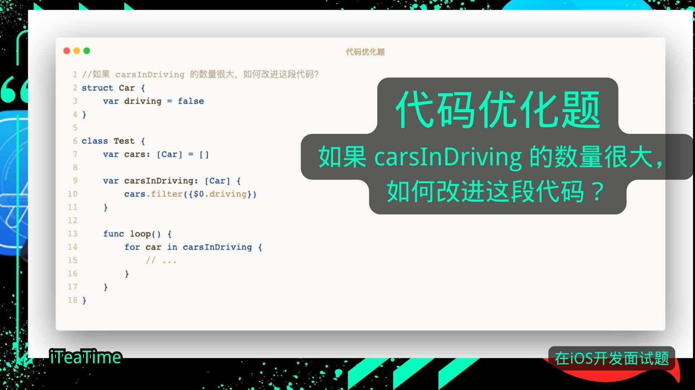

[https://chat.openai.com/share/29d0a44a-26cc-4685-a68a-92a134be6d3e](https://chat.openai.com/share/29d0a44a-26cc-4685-a68a-92a134be6d3e)


## 题目

如果 carsInDriving 的数量很大，如何改进这段代码？

```swift
struct Car {
    var driving = false
}

class Test {
    var cars: [Car] = []

    var carsInDriving: [Car] {
        cars.filter({$0.driving})
    }

    func loop() {
        for car in carsInDriving {
            // ...
        }
    }
}

```

## 答案

**初始**方案 **：**

```swift
struct Car {
    var driving = false
}

class Test {
    var cars: [Car] = []

    var carsInDriving: [Car] {
        cars.filter({$0.driving})
    }

    func loop() {
        for car in carsInDriving {
            // ...
        }
    }
}

```

在这段代码中，`carsInDriving` 的 getter 方法有 O(n) 的时间复杂度，其中 n 是 `cars` 数组的元素数量。这是因为我们需要检查数组中的每个元素以确定它是否在驾驶。然而，这个过滤操作只会在每次访问 `carsInDriving` 时执行一次，并且结果不会被存储，所以在同一个 `get` 调用中，复杂度是 O(n)。`loop` 方法的时间复杂度也是 O(n)，这是因为它在每次调用时都需要重新计算 `carsInDriving`，然后遍历所有正在驾驶的车。

这里的数组不建议换成set. set主要用于去重的场景, 而且set是无序的.

优化方案1**. 优化后的代码：**

```swift
struct Car {
    var driving = false
}

class Test {
    private var _carsInDriving: Set<Car>? = nil
    var cars: [Car] {
        didSet {
            _carsInDriving = nil
        }
    }

    var carsInDriving: Set<Car> {
        if let carsInDriving = _carsInDriving {
            return carsInDriving
        } else {
            let carsInDriving = Set(cars.filter({$0.driving}))
            _carsInDriving = carsInDriving
            return carsInDriving
        }
    }

    func loop() {
        for car in carsInDriving {
            // ...
        }
    }
}

```

在这段代码中，`carsInDriving` 的 getter 方法在 `_carsInDriving` 为空时具有 O(n) 的时间复杂度，否则它具有 O(1) 的时间复杂度。这是因为我们只在 `_carsInDriving` 为空时计算 `carsInDriving`，并将结果存储在 `_carsInDriving` 中。这样就创建了一个缓存机制。`loop` 方法的时间复杂度仍然是 O(n)，但如果 `carsInDriving` 被多次调用，并且 `cars` 没有发生改变，那么除了第一次计算外，其余的调用都具有 O(1) 的时间复杂度。

**优化方案2：**

```swift
struct Car {
    var driving = false
}

class Test {
    var cars: [Car] = []

    func loop() {
        for car in cars where car.driving {
            // ...
        }
    }
}

```

在你的代码中，`loop` 方法的时间复杂度是 O(n)，这是因为你直接在 `loop` 方法中遍历 `cars`，并在遍历时过滤出正在驾驶的车辆。这个方法的优点是它在每次调用时都对 `cars` 进行实时的过滤，无需依赖额外的状态，但缺点是每次调用 `loop` 时都需要重新过滤 `cars`。

总结起来，哪种方法更好取决于你的使用情况。如果 `cars` 集合经常变化，或者我们不需要频繁地访问正在驾驶的车辆，那么你的方法可能更好。如果我们需要频繁地访问正在驾驶的车辆，但 `cars` 集合不经常变化，那么第二种优化后的方法可能更好。

方案的另一种写法:

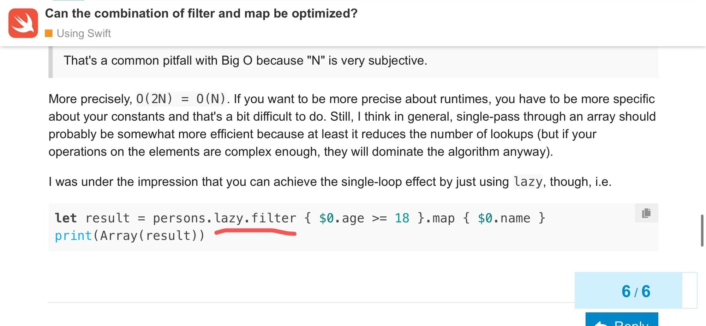

let result = persons.lazy.filter { $0.age >= 18}.map{ $0.name }
print(Array(result))
首先，我们需要理解`lazy`在Swift中的含义。当我们在集合类型（如数组）上调用`lazy`属性时，我们会得到一个特殊的集合视图，该视图会在需要时才进行计算，从而可能提高性能。这种懒惰的行为对于昂贵的计算操作（如我们的`.filter`操作）可能非常有用。

```swift
struct Car {
    var driving = false
}

class Test {
    var cars: [Car] = []

    func loop() {
        for car in cars.lazy.filter({$0.driving}) {
            // ...
        }
    }
}

```

在这个版本中，我们在`loop`函数内部使用了`lazy.filter`。这会创建一个可以延迟计算其过滤操作的集合视图。由于过滤操作是懒惰的，所以只有在循环中实际需要时，过滤操作才会执行。这种方法有助于避免创建一个新的数组（只包含正在驾驶的车辆），从而减少内存使用并提高性能，尤其是在`cars`数组非常大的情况下。

除了lazy, 还加了一个暂存. 空间换时间.

方案3: 

```swift
struct Car {
    var driving = false
}

class Test {
    var cars: [Car] = []

    lazy var carsInDriving: [Car] = {
        cars.filter({$0.driving})
    }()

    func loop() {
        for car in carsInDriving {
            // You can do something with each driving car here.
        }
    }
}

```

在这个版本中，我们将 `Dog` 结构体替换为 `Car`，并将 `running` 属性替换为 `driving`，这样 `driving` 就表示这辆车是否正在行驶。类 `Test` 中的其他部分也进行了相应的修改。现在 `loop` 函数会遍历所有正在驾驶的车辆。

方案4的另一种写法

```swift
struct Car {
    var driving = false
}

class Test {
    var cars: [Car] = []

    lazy var carsInDriving: LazySequence<[Car]> = {
        cars.lazy.filter({$0.driving})
    }()

    func loop() {
        for car in carsInDriving {
            // ...
        }
    }
}

```

在这个版本中，`carsInDriving`是一个`lazy`属性，并且是一个`LazySequence`。当你第一次访问`carsInDriving`（在这里是在`loop`函数中）时，它将计算其值并将结果存储起来。与方法A相比，这种方法可以防止在每次调用`loop`函数时都进行过滤操作。但是，如果`cars`数组中车辆的`driving`状态经常发生变化，那么这种方法可能不能反映最新的状态，因为`carsInDriving`在第一次计算后就被存储了起来，不会再更新。

所以，哪种方法更好取决于具体的使用场景。如果你的`cars`数组经常发生变化，那么方法A可能更好，因为它会在每次执行`loop`时反映最新的状态。然而，如果`cars`数组基本不变，但你需要频繁地执行`loop`，那么方法B可能更好，因为它可以避免不必要的重复计算。


## WHY Swift not ObjC?

[https://chat.openai.com/share/eef4d254-7ff5-4b37-b58e-431fb10e4e97](https://chat.openai.com/share/eef4d254-7ff5-4b37-b58e-431fb10e4e97)

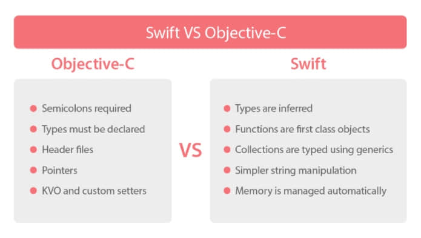

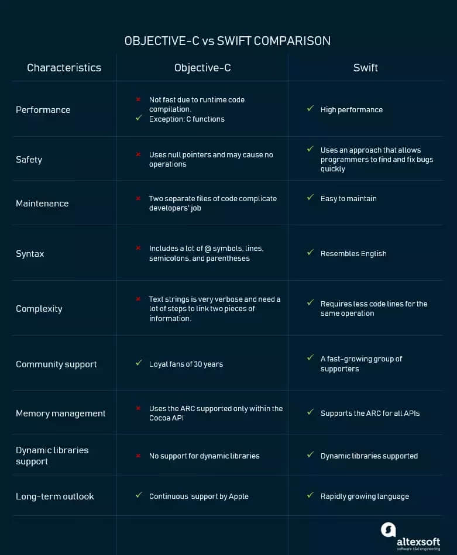


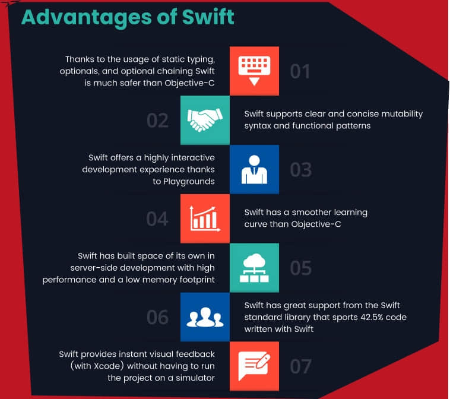


## 介绍一下 Swift 相关的重要变更事件

## Swift ⼤事记

1）ABI 稳定
swift 5 2019 发布， ABI 稳定，不会过⼤的增加包体积了；

Swift 演进之路
本篇主要是对[《A站 的 Swift 实践》]
([https://ming1016.github.io/202](https://ming1016.github.io/202)[https://mp.weixin.qq.com/s/z4MKCSNXu7kBY7uU8KC1Aw](https://mp.weixin.qq.com/s/z4MKCSNXu7kBY7uU8KC1Aw)

[https://ming1016.github.io/2022/02/10/swift-evolutionary-path/](https://ming1016.github.io/2022/02/10/swift-evolutionary-path/)

2）SwiftUI、Combine、Concurrency（都开始于 iOS 13+）
1」SwiftUI
2」Combine
Combine 是⼀种响应式编程范式，采⽤声明式的 Swift API。
Combine 的三个核⼼概念 - 发布者 - 订阅者 - 操作符：

```swift
let pA = Just(0)
let _ = pA.sink { v in
    print("pA is: \(v)")
}

let pB = [7,90,16,11].publisher
let _ = pB

    .sink { v in

        print("pB: \(v)")
    }

class AClass {
    var p: Int = 0 {
        didSet {
            print("property update to \(p)")
        }
    }
}
let o = AClass()

let _ = pB.assign(to: \.p, on: o)
```

3」Concurrency

Swift Concurrency 的实现⽤了 LLVM的协程 把 async/await 函数转换为基于回调的代码
Swift Concurrency 不是建⽴在 GCD 上，⽽是使⽤的⼀个全新的线程池。

## What is the difference between a struct and a class in Swift?

[https://chat.openai.com/share/9d33c809-8034-4ef2-a54b-5e6b20bc4178](https://chat.openai.com/share/9d33c809-8034-4ef2-a54b-5e6b20bc4178)

In Swift, **Array, String, and Dictionary are all value types**. They behave much like a simple int value in C, acting as a unique instance of that data. Reference Type : Copying a reference on the other hand implicitly creates a shared instance.

## struct VS class?
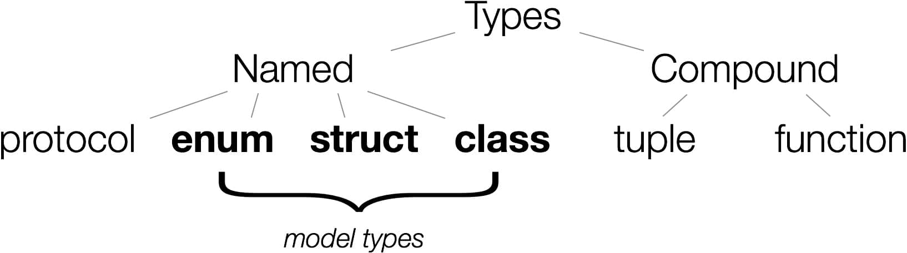


[Getting to Know Enum, Struct and Class Types in Swift](https://www.kodeco.com/7320-getting-to-know-enum-struct-and-class-types-in-swift)

`class` performing faster than `struct` or the other way around

## class 和 struct 的区别

1）class 是引⽤类型，struct 是值类型；

2）如果⾥⾯对象较少，使⽤ struct ⽐较节省性能。

3）struct 不可被继承 -（另外加⼀条 enum 也是值类型）

4）struct ⾥的 class，即使 struct 复制了，它也是引⽤类型 ；
重要：例外，闭包⾥使⽤ Struct 是⼀份引⽤，除⾮明确的 copy ⼀份；

5）⽬前 Swift 的 Foudation 基本全⽤ Struct 实现了，原因是？
Why Choose Struct Over Class? 来⾃ StackOverFlow 

[Why Choose Struct Over Class?](https://stackoverflow.com/questions/24232799/why-choose-struct-over-class)

1」内存上，值引⽤在栈区，引⽤类型在堆区进⾏存储和操作，栈区的运⾏效率更⾼；
2」多线程的环境下更安全，写时复制的操作可以最⼤限度的优化性能，也不⽤担⼼内存泄露（互相引⽤）；
3」引申知识：为什么栈在⾼地址？这样栈的起始位置固定，扩展的时候不需要迁移整个栈的数据。

关于为什么栈区操作⽐堆区操作快，可以看这篇⽂章：Swift 开发中，为什么要远离 Heap？

[https://www.jianshu.com/p/aca50c5a9d64](https://www.jianshu.com/p/aca50c5a9d64) 

[Swift 开发中，为什么要远离 Heap？](https://www.jianshu.com/p/aca50c5a9d64)

Swift 的堆区是使⽤双向链表进⾏内存分配的，

|  | heap | stack |
| --- | --- | --- |
| 结构 | Swift 基于双向链表 |  栈 |
| 特点 |  ⼿动分配⼤⼩、随时释放空间，数据进出⽆序 | ⾃动分配⼤⼩，⾃动释放内存，数据先进后出
| 操作  | 查询之后分配/释放，之后再做整合，复杂度⾼  | 依靠栈底指针移动来分配/释放，复杂度低
| 对象  | 引⽤类型如 class。引⽤ 计数，变量类型等信息 | 值类型如 struct, enum, Int。函数返回值，局部变量
| 场景  | C 中的 malloc 和 free 操作，java 中的garbage collection，iOS 中的MRC、ARC | 适⽤于撤销、保存操作 |
| 线程 | 共享，多线程不安全  | 独享，多线程安全 |

copy on write ⻅下⾯的说明；

## Q: if a struct is an immutable value type, why we can mutate the size property?

A: copy on write

[Handling Mutable Structs in Swift](https://anshul-vyas380.medium.com/handling-mutable-structs-in-swift-7b95add387d)

mutating 关键词的含义

```jsx
				struct Mutable {
            var x: Int;
            mutating func Mutate() -> Int {
                x = x + 1;
                return x;
            }
        }
        var mutable = Mutable(x: 0)
        print(mutable.Mutate())
        print(mutable.Mutate())
        print(mutable.Mutate())
```

There are a number of things this program could do. Does it:

✅1) Print 1, 2, 3 -- because m is readonly, but the "readonly" only applies to m, not to its contents.
❌2) Print 0, 0, 0 -- because m is readonly, x cannot be changed. It always has its default value of zero.
❌3) Throw an exception at runtime, when the attempt is made to mutate the contents of a readonly field.
❌4) Do something else

In class, all func are mutating. But for struct and enum we need to specify.

[Mutating function inside class](https://stackoverflow.com/a/46460684/3395008)

[Does swift copy on write for all structs?](https://stackoverflow.com/a/43493749/3395008)

在SwiftUI中的体现:

```
struct Point {
   var x:Float = 0
}

var p1 = Point()
var p2 = p1 //p1 and p2 share the same data under the hood
p2.x += 1 //p2 now has its own copy of the data
```

struct 是赋值， class是引用

在struct 的[计算属性](https://so.csdn.net/so/search?q=%E8%AE%A1%E7%AE%97%E5%B1%9E%E6%80%A7&spm=1001.2101.3001.7020)（computed property）里，不允许改变成员变量


加上 **@State 就可以改变了**

参考：

[用狀態設計 SwiftUI 畫面 — 認識 State property](https://medium.com/%E5%BD%BC%E5%BE%97%E6%BD%98%E7%9A%84-swift-ios-app-%E9%96%8B%E7%99%BC%E5%95%8F%E9%A1%8C%E8%A7%A3%E7%AD%94%E9%9B%86/%E7%94%A8%E7%8B%80%E6%85%8B%E8%A8%AD%E8%A8%88-swiftui-%E7%95%AB%E9%9D%A2-%E8%AA%8D%E8%AD%98-state-property-binding-27fea6885ead)

[Mutating Readonly Structs](https://learn.microsoft.com/en-us/archive/blogs/ericlippert/mutating-readonly-structs)


[Swift: Mutating Function](https://youtu.be/lXp3MNT_EZc)

[https://youtu.be/lXp3MNT_EZc](https://youtu.be/lXp3MNT_EZc)

## 4、Swift 的 Copy-on-Write 是怎么实现的

1、Swift 分 引⽤类型 (Class) 和值类型 (Struct / Enum)，值类型赋值、函数传值时，会触发 Copy 操作，此时对值类型写
时复制就能提升性能；
优势：
1）读多写少的情况，可以提⾼读取效率；
2）集合传值之后修改，不会改变原来的值；（OC 需要⽤ deep Copy）
劣势：
1）线程不安全，写时占内存
2）⾃定义的结构体并不能⾃动拥有 写时复制 的属性
Tips：
1）引⽤类型不⽤ Copy-on-Write  ，是因为性能消耗⽐直接复制还⾼
2）isKnownUniquelyReferenced 可以⽤来判断 Class 是否被唯⼀引⽤，从⽽进⾏ copy on write；
3）Array、Dictionary、Set 等类型都是 Struct 实现的，值类型，⽀持 Copy-on-Write；
写时复制，swift 的数组、字典等就是如此，原来是值类型，但是遇到写操作的时候，复制⼀份出来；
isKnownUniquelyReferenced 源代码 。

[](https://github.com/apple/swift/blob/ad0a5bf12b9f261263f20598bc4767494ff5d678/stdlib/public/core/ManagedBuffer.swift)

调⽤了  Builtin.swift  

[](https://github.com/apple/swift/blob/32811bac9fa18ffea4ba79c8618216f9e71dc1d0/stdlib/public/core/Builtin.swift)

⾥⾯的 isUnique ⽅法：

关于 Builtin：Swift Builtin

SILGen/SILGenBuiltin.cpp 

[](https://github.com/apple/swift/blob/74d7eacfe5afadb44b520f01211d00c6490a701f/lib/SILGen/SILGenBuiltin.cpp#L954)

⾥⾯的实现：（SIL 的特点其⼆：检测不可达（未使⽤）的代码 & 在代码发送给 LLVM 前进⾏
优化）


```swift
"// This should only accept as an operand type single-refcounted-pointer types,
"// class existentials, or single-payload enums (optional). Type checking must be
"// deferred until IRGen so Builtin.isUnique can be called from a transparent
"// generic wrapper (we can only type check after specialization).
static ManagedValue emitBuiltinIsUnique(SILGenFunction &SGF,
                                        SILLocation loc,
                                        SubstitutionMap subs,
                                        ArrayRef<ManagedValue> args,
                                        SGFContext C) {

  assert(subs.getReplacementTypes().size() "== 1 "&&
         "isUnique should have a single substitution");
  assert(args.size() "== 1 "&& "isUnique should have a single argument");
  assert((args[0].getType().isAddress() "&& !args[0].hasCleanup()) "&&
         "Builtin.isUnique takes an address.");

  return ManagedValue"::forUnmanaged(
    SGF.B.createIsUnique(loc, args[0].getValue()));
}
```

swift
createIsUnique 

[](https://github.com/apple/swift/blob/74d7eacfe5afadb44b520f01211d00c6490a701f/include/swift/SIL/SILBuilder.h#L2194)

是⼀个 C++ ⽅法，应该在编译期就确定了（静态⽅法）

下⾯是⼀个⾃⼰实现  Copy-on-Write 的例⼦

```swift
"// isKnownUniquelyReferenced 的使⽤
isKnownUniquelyReferenced(&object: T)

final class Box<A> {
    var unbox:A
    init(_ value:A) {
        self.unbox = value
    }
}   
var a = Box(NSMutableData())
isKnownUniquelyReferenced(&a)"//true
var b = a 
isKnownUniquelyReferenced(&a)"//false

"// 写时复制的代码原理
final class Ref<T> {
  var val : T
  init(_ v : T) {val = v}
}

struct Box<T> {
    var ref : Ref<T>
    init(_ x : T) { ref = Ref(x) }

    var value: T {
        get { return ref.val }
        set {
          if (!isUniquelyReferencedNonObjC(&ref)) {
            ref = Ref(newValue)
            return
          }
          ref.val = newValue
        }
    }
}
```

当进⾏ set 的时候判断是否有多个 reference，如果是多个 reference 则进⾏拷⻉，反之则不会。

## Swift Copy-on-Write 是怎么去实现的?

[Understanding Copy on Write](https://fabernovel.github.io/2020-10-30/Understanding-Copy-on-Write)

原理和 KVO有点类似.

```swift
// Actual CoW implementation
struct CoWSomeClass {
    init(value: Int) {
        storage = SomeClass(value: value)
    }

    private storage: SomeClass

    var value: Int {
        get {
            storage.value
        }
        set {
            if !isKnownUniquelyReferenced(&storage) {
                storage = storage.copy()
            }
            storage.value = newValue
        }
    }
}

// Storage definition
extension CoWSomeClass {
    private class SomeClass {
        var value: Int

        init(value: Int) {
            self.value = value
        }

        func copy() -> SomeClass {
            SomeClass(value: value)
        }
    }
}
```

---

### **35. What are the basic categories of types in Swift?**

Swift requires each object to have a type, which must be known during compilation. Swift types fall into two groups:

- **Value types**, which are typically described as a struct, enum, or tuple and allow each instance to maintain a separate copy of its data.
- **Reference types**, where a single copy of the data is shared by all instances, and where the type is often expressed as a class.

### **26. What is a Tuple in Swift?**

A tuple is a collection of many values combined into a single compound value. It contains elements in an organized list. You can access a tuple's object data in two ways: by name or position.

A Swift tuple can accommodate two values, one of the string and one of the integer types.

### **38. Is it possible to return multiple values from a function in Swift? If yes, how?**

Like the majority of programming languages, Swift only allows each function to return a single value. If this element is a primitive type, you will only return one value.

Additionally, a thing could be a complex type, such as a class, struct, tuple, or array. You can pack several values into a complex type in this situation. After that, you formally return a single item with numerous values kept inside this data structure.

**Here’s how we can return multiple values kept inside a tuple:**

```
func functionWithMultipleReturnValues(
val1: Int,
val2: Int
) -> (sum: Int, product: Int) {
let sum = val1 + val2
let prod = val1 * val2
return (sum, prod)
}
let result = functionWithMultipleReturnValues(val1: 10, val2: 20)
let s = result.sum
let p = result.product
```

## final 是什么：

不能继承和重写,可⽤到 属性/函数/类；

## String 与 NSString 的关系与区别：

能够互相转换，⼀个值类型，⼀个引⽤类型；

## defer 使⽤场景：

defer ⾥的内容会在 { } 结束时执⾏；

## struct 在堆区还是栈区？

值引⽤，栈区

## 属性中，值属性，和计算属性有什么区别？

计算属性不占内存，值属性占⽤内存；

## 声明⼀个只有⼀个参数没有返回值闭包的别名

```swift
typealias SomeClosuerType = (String) "-> ()
let someClosuer: SomeClosuerType = { (name: String) in
    print("hello,", name)
}
```

#### 2. Principle of Dictionary
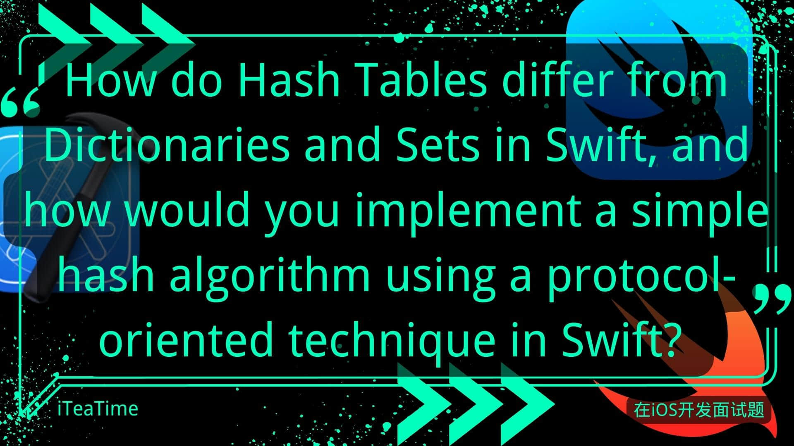

https://medium.com/swift-algorithms-extras/understanding-hash-tables-dictionaries-sets-with-swift-4605e905973e

https://chat.openai.com/share/c7881993-fedb-4089-bf83-bf8e05f1cab4


## **泛型：**

## Q.什么是泛型，swift哪些地方使用了泛型？

答：
泛型（generic）可以使我们在程序代码中定义一些可变的部分，在运行 runtime 的时候指定。使用泛型可以最大限度地重用代码、保护类型的安全以及提高性能。
泛型可以将类型参数化，提高代码复用率，减少代码量。

例如 optional 中的 map、flatMap 、?? (泛型加逃逸闭包的方式，做三目运算)

## 

## Generic in Swift ****泛型<T>****

[An in depth look at generics in Swift — The Mobile Entity](https://www.themobileentity.com/home/an-in-depth-look-at-generics-in-swift)

[Swift 范型（Generics译文） - 掘金](https://juejin.cn/post/6870424765958455303)

[Swift 初体验（10）- 泛型 【完结🎉🎉🎉】](https://www.freecodecamp.org/chinese/news/swift-getting-started-10/)

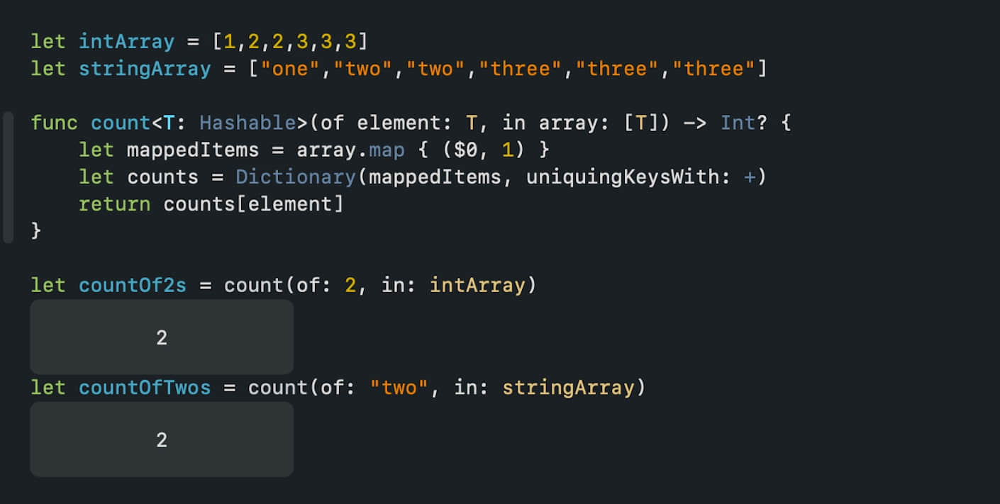


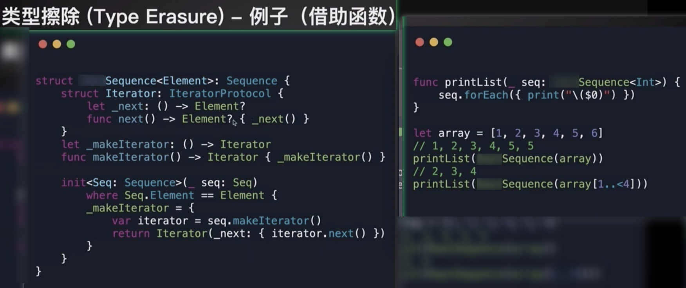


[https://chat.openai.com/share/faa41aed-9f00-4070-b6f1-ab3be7dbb238](https://chat.openai.com/share/faa41aed-9f00-4070-b6f1-ab3be7dbb238)

## 

## *10、泛型的本质*

*1）泛型的本质是 参数化类型 ，<T> ⾥⾯的 T 就是个占位符，系统这样就不会检查类型了；
2）泛型可以让开发者灵活定义函数和类型，避免重复代码，使代码的表意更清晰和抽象；
3）associatedtype（关联类型） 是在 protocol ⾥使⽤的泛型
4）where 字句可以限定 关联类型（associatedtype Element // 关联类型）的具体类型, 如: extension ListProtcol where
Element = Int
5）T 和 Any 的区别？
Any 类型会避开类型的检查，具体⻅下⾯代码例⼦：*

```swift

*1"//输⼊输出类型⼀致
2func add<T>( input: T) "-> T {
3    "//""...
4    return input;
5}
6
7"//输⼊输出类型会不⼀致
8func anyAdd(* input: Any) "-> Any {
9    "//""...
10    return input;
11}

```


#### 7. What's the difference between `opaque type` and `generic`?
https://docs.swift.org/swift-book/documentation/the-swift-programming-language/opaquetypes/

https://chat.openai.com/share/87bd8875-d80d-4567-97f6-fe869edc8f7b

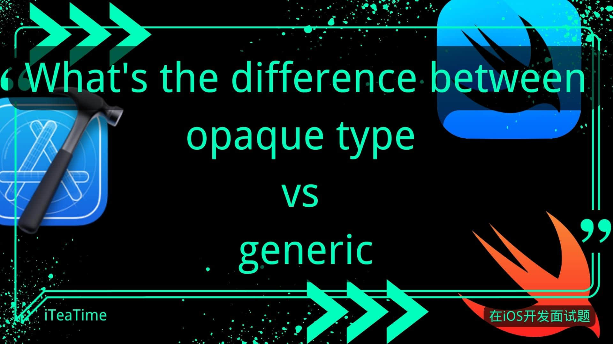


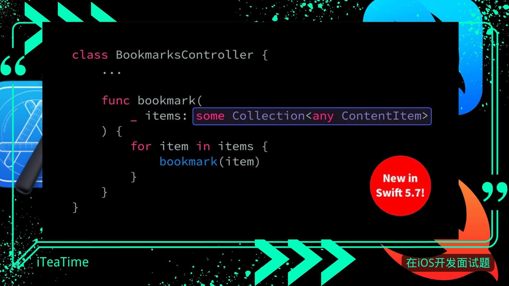
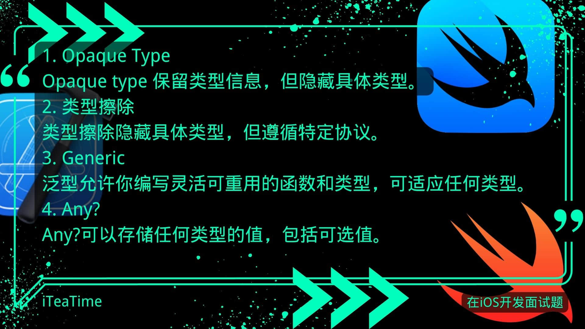


类型定义方式 | 定义|优点|缺点 | 典型场景
:-------------:|:-------------:|:-------------:|:-------------:|:-------------:
Opaque Type| 保留类型信息，但隐藏具体类型。Opaque Type在返回时保留类型信息。有助于代码重用和灵活性。| 保留类型信息。 </p>提供了更明确的返回类型的约束。</p>隐藏实现细节。| 在类型推断和编译时间上可能有一些开销。 </p>无法直接查看和操作内部类型。</p>可能不如泛型那样灵活。| SwiftUI中的some View。</p> ```var body: some View { Text("Hello, World!") }```
类型擦除 | 隐藏具体类型，但遵循特定协议。 | 隐藏具体类型，实现了封装。</p>允许我们使用特定协议类型，而不用关心具体实现。| 在擦除类型后，原始类型信息无法恢复，可能会丧失一些功能。</p>创建类型擦除容器可能会增加代码复杂性。</p>在性能上可能有一些开销。| Swift的AnyPublisher，它可以持有任何实现了Publisher协议的类型。</p>```func fetchData() -> AnyPublisher<Data, Error> {URLSession.shared.dataTaskPublisher(for: url).map(\.data).eraseToAnyPublisher()}```
Generic | 允许你编写灵活可重用的函数和类型，可适应任何类型。 |  强类型，提供了编译时类型安全性。 </p>允许编写灵活的、可重用的代码。|  用起来可能比较复杂，尤其是对于复杂的泛型代码，很难理解和调试。</p>可能会增加编译时间。</p>无法用于某些动态的场景，如需要在运行时改变类型。| 容器类如Array和Dictionary,</p> ```func swapTwoValues<T>(_ a: inout T, _ b: inout T) { let temporaryA = a;a = b;b = temporaryA}```
Any? | 可以存储任何类型的值，包括可选值。| 完全灵活，可以代表任何类型。| 缺乏类型安全。你需要自行确定类型，并做正确的类型转换。如果不正确，可能会在运行时出错。</p> 容易导致代码混乱，难以追踪和调试。</p>对于开发者来说，无法确定具体的类型，很难做出正确的操作。| 解析JSON, </p> ```let value: Any? = "Hello, World!"; if let string = value as? String {    print("It's a string: \(string)"); } else if let number = value as? Int {    print("It's an integer: \(number)"); }```


从  Protocols中 定义方(开发者) 和 调用方(使用者)的角度来说.
- Generics中，是开发者不需要知道类型或协议，但是使用者知道类型或协议。
- Opaque中，是开发者知道协议，但是使用者不知道协议。
- Type Erasure是在Generics的基础之上,通过盒子包装来规避编译器的一种方式。


不同类型 | 对比
:-------------:|:-------------:
Opaque Type 与 Generic | Opaque Type和泛型都有助于代码重用和灵活性。泛型在定义时不知道具体类型，而Opaque Type在返回时保留类型信息。
Opaque Type 与 Any? | Opaque Type隐藏具体类型但保留类型信息；Any?不保留类型信息。
类型擦除与 Generic |  类型擦除通常用于特定协议，隐藏具体类型；泛型提供更广泛的灵活性，允许任何类型。
类型擦除与 Any? | 类型擦除遵循协议，有结构；Any?完全灵活，允许任何类型。
Generic 与 Any?|  泛型强制执行类型一致性，提供类型安全；Any?完全灵活但缺乏类型安全。


举例说明, 举一个MVVM架构的例子，将Model中的某些具体类型用Opaque Types表达，然后再进行改造。

先举个例子，我们创建一个"User"的模型，具体类型用Opaque Types表达，并创建一个"UserViewModel"来处理该模型。

### Any?
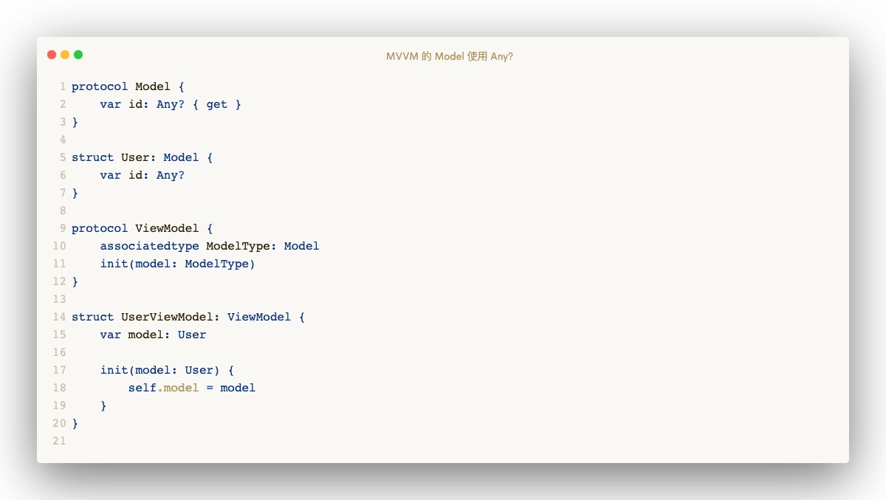

我们可以把id类型设置为Any?，使得我们可以接受任何类型的id。

```swift
protocol Model {
    var id: Any? { get }
}

struct User: Model {
    var id: Any?
}

protocol ViewModel {
    associatedtype ModelType: Model
    init(model: ModelType)
}

struct UserViewModel: ViewModel {
    var model: User

    init(model: User) {
        self.model = model
    }
}
```


### 泛型
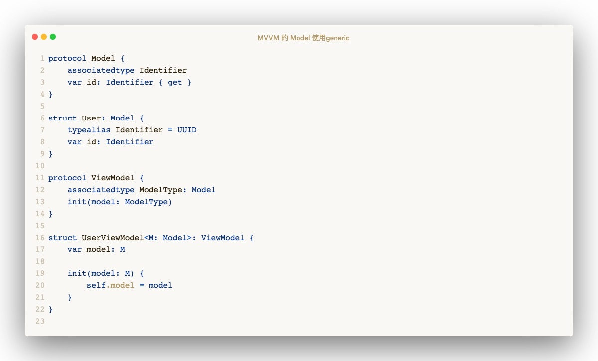

通过使用泛型，我们可以保持类型的安全性，而不必知道具体类型。

```swift
protocol Model {
    associatedtype Identifier
    var id: Identifier { get }
}

struct User: Model {
    typealias Identifier = UUID
    var id: Identifier
}

protocol ViewModel {
    associatedtype ModelType: Model
    init(model: ModelType)
}

struct UserViewModel<M: Model>: ViewModel {
    var model: M

    init(model: M) {
        self.model = model
    }
}
```
这样，UserViewModel可以处理任何满足Model协议的类型。

### 类型擦除

我们可以使用类型擦除来隐藏具体类型，通常使用一种包装器来实现。如下面的例子中，我们创建了一个AnyModel来隐藏具体的Model类型：
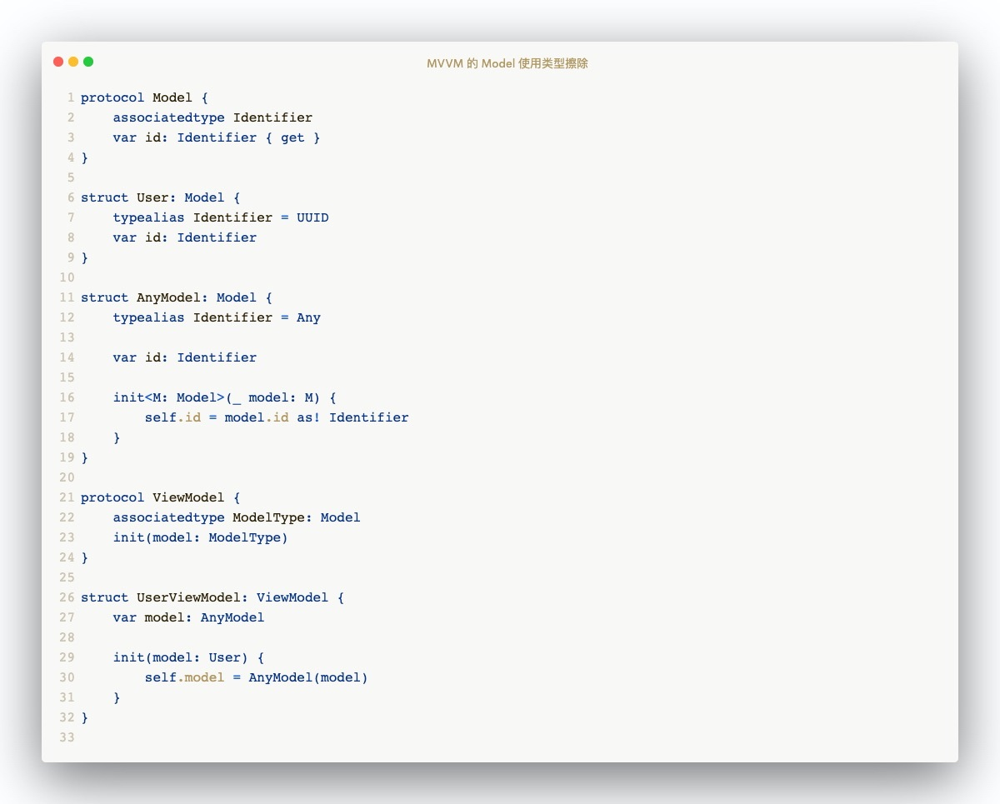

```swift
protocol Model {
    associatedtype Identifier
    var id: Identifier { get }
}

struct User: Model {
    typealias Identifier = UUID
    var id: Identifier
}

struct AnyModel: Model {
    typealias Identifier = Any
    
    var id: Identifier
    
    init<M: Model>(_ model: M) {
        self.id = model.id as! Identifier
    }
}

protocol ViewModel {
    associatedtype ModelType: Model
    init(model: ModelType)
}

struct UserViewModel: ViewModel {
    var model: AnyModel

    init(model: User) {
        self.model = AnyModel(model)
    }
}
```
这样，具体的Model类型被隐藏在了AnyModel里面，UserViewModel只知道它处理的是一个满足Model协议的对象。


### Opaque Types
Opaque Types在这个例子中，我们无需公开具体的Model类型，只需表达它遵循了某个协议。
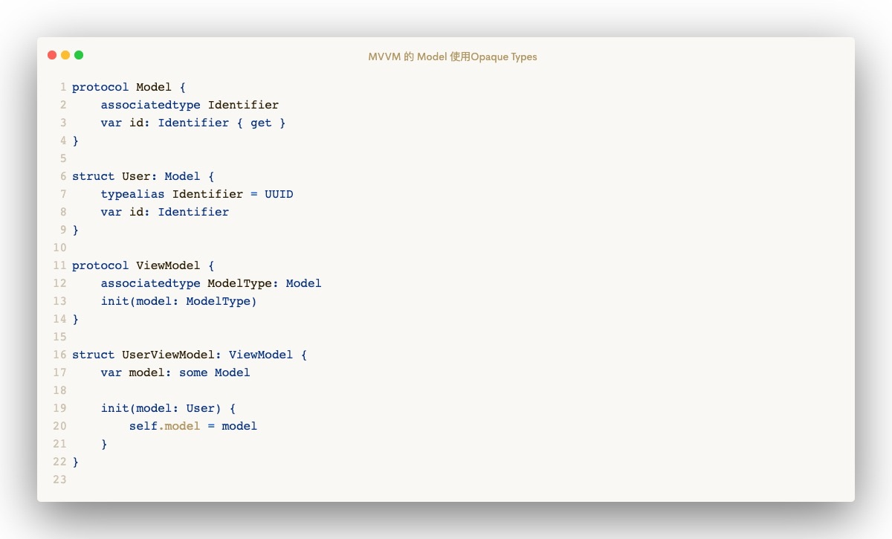

```swift
protocol Model {
    associatedtype Identifier
    var id: Identifier { get }
}

struct User: Model {
    typealias Identifier = UUID
    var id: Identifier
}

protocol ViewModel {
    associatedtype ModelType: Model
    init(model: ModelType)
}

struct UserViewModel: ViewModel {
    var model: some Model

    init(model: User) {
        self.model = model
    }
}
```

在这个例子中，ViewModel不知道具体的Model类型，只知道Model满足某个协议，从而实现了封装。

所有能用Generic的场景都可以使用Opaque Type 吗? 我是否应该把所有的Generic的升级到使用Opaque Type?

举一个可以用Generic的场景, 但是却不可以使用Opaque Type 的例子. 
一个典型的场景就是泛型容器，比如一个可以储存任何类型的数组。在这种情况下，我们需要在类型声明和实例化时都使用同一个类型参数，因此我们不能使用Opaque Type。请看以下的例子：

```swift
struct GenericArray<Element> {
    var elements: [Element]
    
    init(_ elements: [Element]) {
        self.elements = elements
    }
    
    func getElement(at index: Int) -> Element {
        return elements[index]
    }
}

let intArray = GenericArray([1, 2, 3])
let firstElement = intArray.getElement(at: 0) // Returns 1

let stringArray = GenericArray(["Hello", "World"])
let firstString = stringArray.getElement(at: 0) // Returns "Hello"
```

在这个例子中，我们创建了一个名为`GenericArray`的泛型结构体，它可以储存任何类型的数组。我们可以在实例化`GenericArray`时指定`Element`的具体类型（例如`Int`或`String`），然后在调用`getElement(at:)`方法时，返回值的类型也会是我们指定的类型。

然而，如果我们尝试使用Opaque Type来替换这个例子中的泛型，我们会遇到问题。Opaque Type只能用在函数或方法的返回类型上，因此我们无法使用它来定义一个可以储存任意类型的数组。即使我们可以在函数或方法的返回值中使用Opaque Type，也无法在其他地方使用相同的类型，因此我们无法实现和上面例子中一样的功能。


各种方法都有其优点和缺点。Opaque Types保持类型一致性，但不能用于存储变量。类型擦除隐藏了具体类型，但可能使性能下降。泛型提供了类型安全，但可能会使代码变得复杂。Any?是最灵活的，但是在使用时需要进行类型检查或强制类型转换。


## 内存管理、**性能优化和调试：**

## When do you use static variables?

[https://chat.openai.com/share/3ce697b3-5f00-41b9-be78-693a4bc9a8b0](https://chat.openai.com/share/3ce697b3-5f00-41b9-be78-693a4bc9a8b0)

static 关键字和 class 关键字 修饰的类⽅法有什么区别？
static 修饰的不能被继承，class 修饰 可以被继承；
class 只能在类⾥⽤，不能在结构体、枚举中⽤；
class 只能修饰计算属性，不能修饰值属性；

## What is weak and unowned in Swift? What is their difference?

https://www.advancedswift.com/strong-weak-unowned-in-swift/

iOS weak 和 unowned 区别? 

swift weak 和 unowned 的区别

weak 同 OC ，在没有引⽤技术的时候⾃动置空，必须被⽣命为 var；
unowned 不会为空，可以使⽤ let 声明，性能损耗⽐ weak ⼩⼀点，
要保证 unowned 的⽣命周期要和强引⽤对象同样或者更⻓，不然就会导致崩溃；

## 解决 retain cycle, 什么时候用unowned、weak、closure capture list??
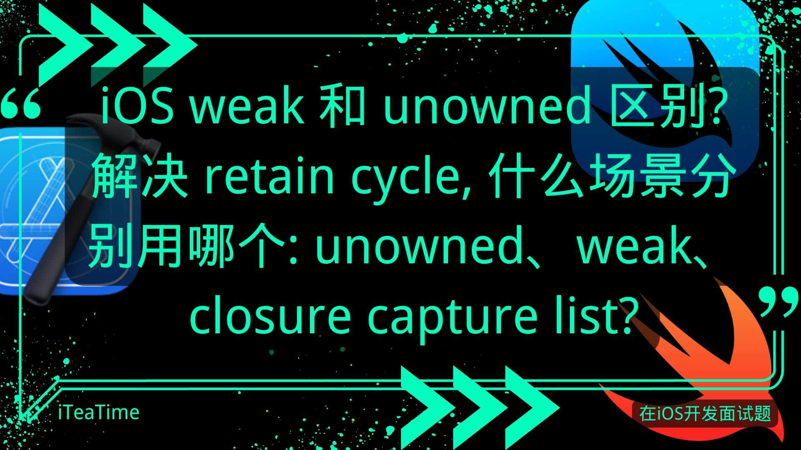

In Swift, both `weak` and `unowned` are ways to prevent strong reference cycles (also known as retain cycles) which can cause memory leaks in your application. When two instances of classes reference each other, and they both have strong references to each other, they can't be deallocated because each thinks that the other is still in use. This is where `weak` and `unowned` come into play.

`weak` and `unowned` references allow one instance in a reference cycle to refer to the other instance without keeping a strong hold on it, helping to prevent strong reference cycles.

**Weak**

A `weak` reference is a reference that doesn't keep the referenced object alive. The weak reference becomes `nil` as soon as the referenced object is deallocated. Because weak references can become `nil`, they must be declared as optional types.

Here is an example of `weak`:

```
class MyClass {
    weak var weakProperty: AnotherClass?
}

```

In this case, `weakProperty` is a weak reference. If the `AnotherClass` instance it references is deallocated, `weakProperty` will be automatically set to `nil`.

**Unowned**

An `unowned` reference doesn't keep the referenced object alive, similar to a `weak` reference. However, unlike a weak reference, an unowned reference is assumed to always have a value; thus, it is non-optional. An unowned reference should be used when you know that the reference will always have a value and you don't want to deal with unwrapping an optional.

Here is an example of `unowned`:

```
class MyClass {
    unowned var unownedProperty: AnotherClass
}

```

In this case, `unownedProperty` is an unowned reference. If the `AnotherClass` instance it references is deallocated, `unownedProperty` will still hold a reference to the now-deallocated object, leading to a runtime error if it is accessed.

**Comparison**

The primary difference between `weak` and `unowned` references is that `weak` references are optional and can become `nil`, while `unowned` references are always expected to have a value.

Therefore, you would typically use `weak` when there's a possibility the referenced object might be deallocated while still being weakly referenced (e.g. delegates). Conversely, you would use `unowned` when you know the referenced object will stick around for as long as the object holding the reference is around (e.g. closures referencing `self` where `self` will outlive the closure).

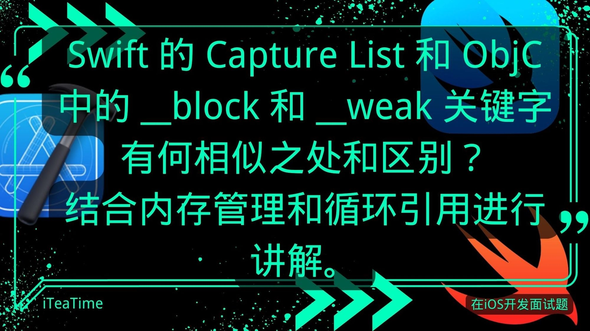


closure 捕获变量的几种方式:
"懒捕获"（Lazy Capture）和"早捕获"（Eager Capture）是两种描述Swift闭包捕获变量或常量方式的术语。这两种概念并不是Swift官方文档中明确定义的，但它们有助于理解闭包如何与其周围的作用域交互。

### 懒捕获（Lazy Capture）

"懒捕获"通常指的是当闭包被执行时，它才会捕获周围作用域中的变量。这意味着如果变量在闭包创建后和执行前发生了改变，闭包将使用最新的值。

```swift
var lazyVar = 1
let lazyCapture = {
    print("Lazy Capture: \(lazyVar)")
}
lazyVar = 2
lazyCapture()  // 输出 "Lazy Capture: 2"
```

### 早捕获（Eager Capture）

"早捕获"则是指在闭包创建的时候，就捕获了周围作用域中的变量或常量。最常见的使用场景就是通过捕获列表明确指定捕获。

```swift
var eagerVar = 1
let eagerCapture = { [eagerVar] in
    print("Eager Capture: \(eagerVar)")
}
eagerVar = 2
eagerCapture()  // 输出 "Eager Capture: 1"
```

### 组合情况

当然，你也可以在同一个闭包中使用多种捕获方式。

```swift
var var1 = 1
var var2 = 1

let mixedCapture = { [var1] in
    print("Eager Capture: \(var1)")
    print("Lazy Capture: \(var2)")
}

var1 = 2
var2 = 2
mixedCapture()  
// 输出 "Eager Capture: 1"
// 输出 "Lazy Capture: 2"
```

这样，`var1` 是在闭包创建时就被捕获的（早捕获），而 `var2` 是在闭包执行时被捕获的（懒捕获）。

### 什么是 Capture List?

在Swift中，捕获列表（Capture List）是唯一明确指定闭包捕获变量或常量方式的语法。捕获列表用方括号 `[]` 包围，并放在闭包表达式的开始处。

在捕获列表中，你可以明确地指定以值的方式捕获（即捕获当前状态下的值），或以引用的方式捕获（即创建一个指向对象的强引用或弱引用）。

### 值类型捕获

```swift
var x = 10
let captureValue = { [x] in
    print("captured value: \(x)")  // 输出：captured value: 10
}
x = 20
captureValue()  // 还是输出：captured value: 10
```

### 引用类型捕获

```swift
class MyClass {
    var value = 0
}

let obj = MyClass()
obj.value = 10

let captureReference = { [obj] in
    print("captured value: \(obj.value)")  // 输出：captured value: 10
}

obj.value = 20
captureReference()  // 输出：captured value: 20
```

### 弱引用和无主引用

使用 `weak` 或 `unowned` 可以避免强引用导致的循环引用问题。

```swift
class MyClass {
    var value = 0
}

var obj: MyClass? = MyClass()
obj?.value = 10

let captureWeakReference = { [weak obj] in
    print("captured value: \(obj?.value ?? -1)")  // 输出：captured value: 10
}

obj?.value = 20
captureWeakReference()  // 输出：captured value: 20

obj = nil
captureWeakReference()  // 输出：captured value: -1
```


-------

相似之处：

1. Swift 的 Capture List 和 Objective-C 的 __block 和 __weak 都是用来更改闭包或 block 对其外部变量的捕获方式，以便更好地管理内存和控制引用。
2. 它们都可以防止循环引用的问题，从而避免内存泄漏。

以下是一个使用捕获列表来避免循环引用的例子：

```swift
class MyClass {
    var value = 0
    var closure: (() -> Void)?

    init() {
        closure = { [weak self] in
            guard let self = self else {
                return
            }
            print(self.value)
        }
    }

    deinit {
        print("MyClass has been deinitialized")
    }
}

do {
    let instance = MyClass()
    instance.value = 1
    instance.closure?()
} // MyClass has been deinitialized will be printed, indicating there's no retain cycle.

```

在这个例子中，我们将闭包的定义放在了类的初始化方法中，并且在闭包内部使用了 self。但是我们使用了 `[weak self]` 在捕获列表中指定了 self 的捕获方式，所以在闭包内部，self 是一个 Optional 类型。当 MyClass 的实例被释放时，由于我们打破了循环引用，所以 MyClass 的 deinit 方法会被调用，这证明我们避免了 retain cycle。

区别：

1. Swift 中，我们可以通过在闭包内部定义捕获列表来显式声明捕获方式，支持 unowned，weak 或值捕获。而在 Objective-C 中，我们需要在声明变量时使用 __block 或 __weak，它们只能使用这两种方式。
2. 在 Swift 中，我们可以在捕获列表中捕获多个变量，每个变量的捕获方式可以不同。在 Objective-C 中，我们需要对每个需要捕获的变量单独使用 __block 或 __weak。
3. Swift 的捕获列表提供了更多的灵活性和控制力，比如你可以在捕获列表中捕获变量的当前值，即使它在外部改变了，闭包内部的值也不会改变。在 Objective-C 中，__block 变量会共享值，即在 block 内部或外部改变，两边都会看到新的值。
4. Swift 的语法更加现代和简洁，对于引用的管理也更加自动化，减少了手动内存管理的复杂性。在 Objective-C 中，开发者需要更加小心地管理内存和引用。

## 举例说明 Capture List 的捕获变量后的特点

Capture List , 变量捕获, 我举了下面的两个例子, 这样对比起来比较清晰, 能够看出来 捕获后, 变量外部改变不会引起闭包里改变的改变.

第1个例子(命名为 "valueCaptureExample"):

```swift
var capturedValue: Int = 0

func captureAndChange(_ closure: @escaping () -> ()) {
    closure()
}

print(capturedValue)  // 打印0

captureAndChange { capturedValue = 1 }

print(capturedValue)  // 打印1

```

第2个例子(命名为 "valueCaptureListExample"):

```swift
var capturedValue: Int = 0

let valueCaptureListClosure = { [capturedValue] in
    print(capturedValue)
}

capturedValue = 1

valueCaptureListClosure()  // 打印0，说明闭包看到的是捕获时的 capturedValue 的值，而不是当前的值

```

现在，我们来对比示例：

- "valueCaptureExample"（值捕获示例）: 在这个例子中，`capturedValue` 是一个值类型，它被一个没有指定捕获列表的闭包捕获。这个闭包可以改变 `capturedValue` 的值，并且这个改变会影响到外部的 `capturedValue`。
- "valueCaptureListExample"（值捕获列表示例）: 在这个例子中，`capturedValue` 是一个值类型，它被一个指定了捕获列表的闭包捕获。这个闭包捕获的是创建闭包时 `capturedValue` 的值，而不是这个变量本身。因此，即使在外部改变了 `capturedValue` 的值，闭包也无法看到这个改变。

其中第二个例子, 和下面的写法是等价的: 

也就是不使用Capture List 功能的写法, 显然Capture List 写法更加简洁:

```swift
        var capturedValue: Int = 0
        let capturedValueForClosure = capturedValue  // 这里相当于 Capture List 中的 [capturedValue]

        let valueCaptureListClosure = {
            print(capturedValueForClosure)  // 在闭包中使用的是 capturedValueForClosure 的值
        }

        capturedValue = 1

        valueCaptureListClosure()  // 打印0，说明闭包看到的是捕获时的 capturedValue 的值，而不是当前的值

```

这里的 `capturedValueForClosure` 的行为模拟了 Capture List 中的 `capturedValue`。即，闭包内部使用的 `capturedValue` 实际上是在闭包创建时就被捕获的 `capturedValueForClosure`，而不是外部变量 `capturedValue`，这样就可以保证即使外部的 `capturedValue` 改变了，闭包内部的 `capturedValue` 也不会受影响。这例子也可以解释 Capture List 的工作原理。

这个确实有点反直觉, 没人会预期代码会这么运行, 所以在开发中要避免这种场景的使用,

当然也不用过于担心, 之所以平时我们不会经常遇到这个问题, 是因为我们经常使用下面的用法, 也就是
如果你没有在捕获列表中明确指定捕获方式，Swift 的闭包会"懒捕获”(lazy capture) 这些变量，这意味着实际的值捕获只会在闭包首次执行时进行。这样，如果该变量在闭包创建之后但在闭包执行之前被修改，闭包内将使用该最新的值

参考以下代码:


```swift
        var capturedValue: Int = 0

        let valueCaptureListClosure = {
            print(capturedValue)  // 在闭包中使用的是 capturedValueForClosure 的值
        }

        capturedValue = 1

        valueCaptureListClosure()  // 打印1 说明闭包看到的是当前的 capturedValue 的值 
```
    
    
但基于上面提到的种种问题, 那么应该如何尽量规避这种情况, 请看下面的例子:


---

第3个例子，我们将其命名为 "referenceCaptureExample":

```swift
class CapturedClass {
    var value: Int = 0
}

var capturedInstance: CapturedClass? = CapturedClass()

let referenceCaptureClosure = {
    print(capturedInstance?.value ?? -1)
}

capturedInstance?.value = 1

referenceCaptureClosure()  // 打印1，说明闭包看到的是 capturedInstance 的当前状态

```

- "referenceCaptureExample"（引用捕获示例）: 在这个例子中，`capturedInstance` 是一个引用类型（类的实例）。尽管没有指定捕获列表，但是由于它是引用类型，所以闭包捕获的是这个引用的副本。因此，即使在外部改变了这个实例的属性，闭包也能看到这个改变。


所以我们可以得出结论:

> 如果想让捕获的值，改变之后，还能让闭包内部知道的话，只能通过引用类型.

---

第四个例子: 

```swift
var capturedValue: Int = 0

print(capturedValue)

let closure = {
    if capturedValue != 0 {
        capturedValue = 2
    }
}

capturedValue = 1

closure()

print(capturedValue)

```

这段代码和例子A的关键区别在于，这里的闭包 `closure` 并没有使用 Capture List 来捕获 `capturedValue` 的初始值，而是直接引用了 `capturedValue`。因此，闭包中的 `capturedValue` 和外部的 `capturedValue` 是同一个变量。所以，在调用 `closure()` 之后，`capturedValue` 的值被改变为2，而不是1。

最后的 `print(capturedValue)` 将会打印出 `2`，而不是 `0`。所以，虽然这两个例子在某些方面看起来类似（都涉及到了闭包和变量的修改），但实际上它们的行为是不同的。这也是 Capture List 在 Swift 闭包中的重要性：使用 Capture List 可以控制闭包捕获变量的行为，使其在需要的时候独立于外部变量。


## What is memory leak ? how to solve?

## 数据处理、语言安全、 **访问权限：**

## Please implement a convenience init method for a subclass.

Sure, let's assume that you have a parent class named `Person` and a subclass named `Employee`.

```
class Person {
    var name: String
    var age: Int

    init(name: String, age: Int) {
        self.name = name
        self.age = age
    }
}

class Employee: Person {
    var jobTitle: String
    var salary: Int

    init(name: String, age: Int, jobTitle: String, salary: Int) {
        self.jobTitle = jobTitle
        self.salary = salary
        super.init(name: name, age: age)
    }

    // convenience init
    convenience init(name: String, jobTitle: String) {
        self.init(name: name, age: 0, jobTitle: jobTitle, salary: 0)
    }
}
```

The convenience initializer is used here to create a new `Employee` instance, and it only requires the `name` and `jobTitle` parameters. It calls the designated initializer with the provided name, jobTitle, and default values for `age` and `salary`.

In this case, an interviewer may follow up by asking why you used a convenience initializer and what the benefits are. Here are some points you might mention:

1. Convenience initializers can simplify the creation of an object by reducing the number of parameters that need to be passed when creating an object.
2. They can provide default values for certain properties to allow for quick and simple object creation in specific cases.
3. They promote code reusability, as you can have multiple convenience initializers that call the same designated initializer with different default parameters.
4. They help make the code cleaner and more readable by abstracting away the complexity of fully initializing an object.

please use convenience init to update those code below, and change objective-c code to swift code:

```
typedef NS_ENUM(NSInteger, CYLGender) {
       CYLGenderUndefined,
       CYLGenderMale,
       CYLGenderFemale
   };

   @interface CYLUser : NSObject<NSCopying>

   @property (nonatomic, readonly, copy) NSString *name;
   @property (nonatomic, readonly, assign) NSUInteger age;
   @property (nonatomic, readwrite, assign) CYLGender gender;

   - (instancetype)initWithName:(NSString *)name age:(NSUInteger)age gender:(CYLGender)gender;
   - (instancetype)initWithName:(NSString *)name age:(NSUInteger)age;
   + (instancetype)userWithName:(NSString *)name age:(NSUInteger)age gender:(CYLGender)gender;

   @end

```

Sure, I can help with that. Here is the equivalent Swift code:

```
import Foundation

enum CYLGender: Int {
    case undefined
    case male
    case female
}

class CYLUser: NSObject, NSCopying {

    let name: String
    let age: Int
    var gender: CYLGender

    init(name: String, age: Int, gender: CYLGender) {
        self.name = name
        self.age = age
        self.gender = gender
    }

    convenience init(name: String, age: Int) {
        self.init(name: name, age: age, gender: .undefined)
    }

    static func user(name: String, age: Int, gender: CYLGender) -> CYLUser {
        return CYLUser(name: name, age: age, gender: gender)
    }

    func copy(with zone: NSZone? = nil) -> Any {
        let copy = CYLUser(name: name, age: age, gender: gender)
        return copy
    }
}

```

In this code:

1. We define an enum `CYLGender` to represent the gender of a user, with cases for undefined, male, and female.
2. We define a class `CYLUser` that has properties for `name`, `age`, and `gender`.
3. We define an initializer that takes `name`, `age`, and `gender` as parameters and assigns them to the respective properties.
4. We define a convenience initializer that takes `name` and `age` as parameters and calls the designated initializer with `gender` set to `undefined`.
5. We define a static function `user` that takes `name`, `age`, and `gender` as parameters and returns a new instance of `CYLUser`.
6. We also make `CYLUser` conform to the `NSCopying` protocol by providing an implementation of the `copy(with:)` method. In this method, we simply create and return a new `CYLUser` with the same `name`, `age`, and `gender` as the current instance.

## 14、Swift 的安全性

1）代码安全
let 属性 - 使⽤ let 申明常量避免被修改。
值类型 - 值类型可以避免在⽅法调⽤等参数传递过程中状态被修改。
访问控制 - 通过 public 和 final 限制模块外使⽤ class 不能被继承和重写。
强制异常处理 - ⽅法需要抛出异常时，需要申明为 throw ⽅法。当调⽤可能会 throw 异常的⽅法，需要强制捕获异
常避免将异常暴露到上层。
模式匹配 - 通过模式匹配检测 switch 中未处理的 case。
2）类型安全
强制类型转换 - 禁⽌隐式类型转换避免转换中带来的异常问题。同时类型转换不会带来额外的运⾏时消耗。。
提示：编写ObjC代码时，我们通常会在编码时添加类型检查避免运⾏时崩溃导致Crash。
KeyPath - KeyPath 相⽐使⽤字符串可以提供属性名和类型信息，可以利⽤编译器检查。
泛型 - 提供泛型和协议关联类型，可以编写出类型安全的代码。相⽐ Any 可以更多利⽤编译时检查发现类型问题。
Enum 关联类型 - 通过给特定枚举指定类型避免使⽤ Any。
3）内存安全
空安全 - 通过标识可选值避免空指针带来的异常问题
ARC - 使⽤⾃动内存管理避免⼿动管理内存带来的各种内存问题
强制初始化 - 变量使⽤前必须初始化
内存独占访问 - 通过编译器检查发现潜在的内存冲突问题
4）线程安全
值类型 - 更多使⽤值类型减少在多线程中遇到的数据竞争问题
async/await - 提供 async 函数使我们可以⽤结构化的⽅式编写并发操作。避免基于闭包的异步⽅式带来的内存循环
引⽤和⽆法抛出异常的问题
Actor - 提供 Actor 模型避免多线程开发中进⾏数据共享时发⽣的数据竞争问题，同时避免在使⽤锁时带来的死锁等
问题
5）快速
值类型 - 相⽐ class 不需要额外的堆内存分配 / 释放和更少的内存消耗
⽅法静态派发 - ⽅法调⽤⽀持静态调⽤相⽐原有 ObjC 消息转发调⽤性能更好
编译器优化 - Swift 的静态性可以使编译器做更多优化。例如 Tree Shaking 相关优化移除未使⽤的类型 / ⽅法等减少
⼆进制⽂件⼤⼩。使⽤静态派发 / ⽅法内联优化 / 泛型特化 / 写时复制等优化提⾼运⾏时性能
提示：ObjC消息派发会导致编译器⽆法进⾏移除⽆⽤⽅法/类的优化，编译器并不知道是否可能被⽤到。
ARC 优化 - 虽然和 ObjC ⼀样都是使⽤ ARC，Swift 通过编译器优化，可以进⾏更快的内存回收和更少的内存引⽤计
数管理
提示： 相⽐ObjC，Swift内部不需要使⽤autorelease进⾏管理。

1. 请解释 Swift 中的访问权限如何设置，以及不同访问级别之间的区别？

## 13、Swift Try catch 的原理？

## 15. How do you filter an array of instances to extract a specific property in Swift?

[https://chat.openai.com/share/05a875de-5e3b-4257-b68b-f296c218f16d](https://chat.openai.com/share/05a875de-5e3b-4257-b68b-f296c218f16d)

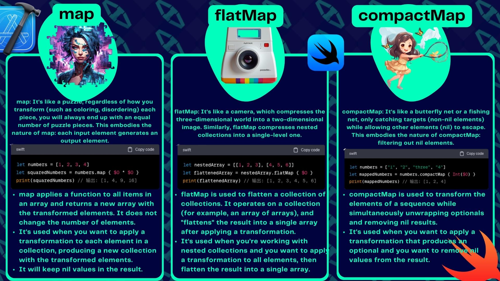


## Difference between map, flatMap and compactMap in Swift

这段代码⽤了哪些语法糖？ 

```swift
[1, 2, 3].map{ $0 * 2 }
```

1」快速创建数组；
2」在没有声明参数列表时，第⼀个参数⽤ $0 代替，后⾯依次类推；
3」闭包没有声明函数参数, 返回值类型, 数量, 依靠的是闭包类型的⾃动推断；
4」闭包中语句只有⼀句时, ⾃动将这⼀句的结果作为返回值；

Swift 中 map, flatMap and compactMap 的区别是什么?

What is their difference? what is the  best situation to use on of them?

The `flatMap` and `compactMap` functions in Swift are used to transform and filter optionals and collections.

**flatMap**:

In Swift, `flatMap` has two main use cases:

1. It can be used with optionals. It works by transforming the optional if it is not `nil` or just returning `nil`. This use of `flatMap` was deprecated in Swift 4.1.
2. It can be used with collections. `flatMap` operates on a collection (for example, an array of arrays), and "flattens" the result into a single array after applying a transformation. For example, given an array of arrays, it will apply the transformation to all elements and flatten the result into a single array.

```
let nestedArray = [[1, 2, 3], [4, 5, 6]]
let flattenedArray = nestedArray.flatMap { $0 }
print(flattenedArray) // Output: [1, 2, 3, 4, 5, 6]

```

**compactMap**:

`compactMap` is used to transform the elements of a sequence while simultaneously unwrapping optionals and removing nil results. This makes `compactMap` a great choice when transforming a collection where the transformation might return an optional.

Here's an example of `compactMap` in action:

```
let numbers = ["1", "2", "three", "4"]
let mappedNumbers = numbers.compactMap { Int($0) }
print(mappedNumbers) // Output: [1, 2, 4]

```

In this example, attempting to convert "three" to an `Int` results in `nil`, which `compactMap` removes from the final array.

As to which to use, it depends on your needs:

- If you have a transformation that returns an optional and you want to remove `nil` values, use `compactMap`.
- If you need to flatten a collection of collections, use `flatMap`.
- If you have an optional and want to transform it if it's not `nil`, you'd previously use `flatMap`, but this is now done using `Optional.map` as of Swift 4.1.

Remember, both `flatMap` and `compactMap` do not mutate the original array. They return new arrays, which is a characteristic of functional programming.


上面讨论的是Swift数组和集合map，flatMap和compactMap基本操作，它们用于对集合中的元素进行转换和过滤。这些函数对于处理同步操作和数据非常有用。

同时，Combine框架中也存在`map`，`flatMap`和`compactMap`的使用。
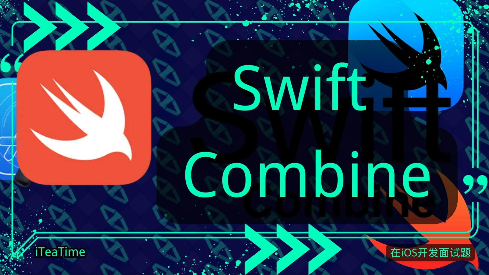

Swift Combine框架是一个响应式编程框架，它可以处理异步事件，例如用户交互，网络响应等。Combine使用了发布者和订阅者模型，发布者发布事件，订阅者接收并处理这些事件。

Combine框架中也有`map`，`flatMap`和`compactMap`操作符，但这些操作符适用于处理异步事件流。这些操作符的行为与数组和集合上的操作非常相似：

- `map`：接收一个转换闭包，将接收到的每个输入事件转换为新的值或事件。
- `flatMap`：接收一个返回Publisher的转换闭包，将接收到的每个输入事件转换为一个新的Publisher。然后，这些新的Publisher的事件被合并到一个共享的事件流中。
- `compactMap`：与`map`操作类似，但会忽略转换闭包返回的nil值。

所以说，`map`，`flatMap`和`compactMap`在Swift的基础集合和Combine框架中都有使用，它们都是对元素进行转换和过滤的操作，但Combine框架中的这些操作是应用在异步事件流上的。


代码演示如下：

注意，这需要Swift 5.0及更高版本，并且需要导入Combine库。

```swift
import Combine

// Create a publisher
let numbersPublisher = [1, 2, 3, 4, 5].publisher

// map
numbersPublisher
    .map { $0 * 10 }
    .sink { print($0) }  // Output: 10, 20, 30, 40, 50

// flatMap
let nestedPublisher = [[1, 2, 3], [4, 5, 6], [7, 8, 9]].publisher
nestedPublisher
    .flatMap { $0.publisher }
    .sink { print($0) }  // Output: 1, 2, 3, 4, 5, 6, 7, 8, 9

// compactMap
let publisherWithNil = [1, nil, 3, nil, 5].publisher
publisherWithNil
    .compactMap { $0 }
    .sink { print($0) }  // Output: 1, 3, 5
```

请注意，以上 Combine 示例是简化的，并且不包含取消订阅的逻辑，实际开发中需要正确地处理和取消订阅。


#### 3. The time complexity of the map, filter, and reduce
O(n)

## 6、Swift 的计算属性、存储属性、懒加载

1）计算属性（Computed Variable）
仅有 get ( readOnly) 或有 get+set 的属性是计算型属性，真正赋值的过程是存在于 set ⽅法中并被底层包装掉的，如果
我们⼿动实现了set ⽅法，就⽆法进⾏正确的赋值。（此处跟 OC 不⼀样）

```swift
1private var _squre: Double = 0.0
2var squre: Double {
3    get {
4        return *squre
5    }
6    set {
7        if (newValue "<= 0) {
8            print("newValue = \(newValue)")
9        } else {
10            squre = newValue
11        }
12    }
13}*
```

*2）存储属性（Sorted Variable）*

```swift
*1class Test {
2    init(width: Double) {
3        self.width = width "// 此处不会调⽤ willset 、didset ⽅法
4        setValue(width, forKey: "width") "// KVC 可以调⽤
5    }
6    var width: Double {
7        willSet {
8            print("willSet⽅法被调⽤")
9            print("在willSet中，width = \(width),newValue = \(newValue)")
10        }
11       
12        didSet {
13            print("didSet⽅法被调⽤")
14            print("在didSet中，width = \(width),oldValue = \(oldValue)")
15        }
16    }
17}*
```

*3）懒加载（Lazy Load） 和计算属性的区别*

*计算属性：*

- *每次都会计算*
- *不分配独⽴空间*

*懒加载*

**

- *本质是个闭包，分配内存空间*
- *在⾸次执⾏时，返回闭包的值*

*和 OC 不同的是， Swift 的懒加载，置空后不会重新调⽤。*

**

## *9、Sequence / ⾼阶函数 / Collection*

*Swift 的 Collections （Sequence 协议）*

**

## 12、混编过程中遇到的 Crash

1）@objc 别名 MBCCC ，对应 CCC xib，iOS 12 以下 闪退；
2）混编  没加 nullable 到 swift 不做解包 会崩溃了；
3）OC 有个 ivar，Swift abi 稳定，⼆进制有脆弱性；如果库的作者改变了对象内公共字段的⼤⼩或布局，偏移量就⽆效
了，程序就没法正常运⾏；（解决⽅案：需要全量编译、或引⽤到这个库的上层库重新编译。）

## 面向对象

## 1、Swift 对象和 OC 对象的区别
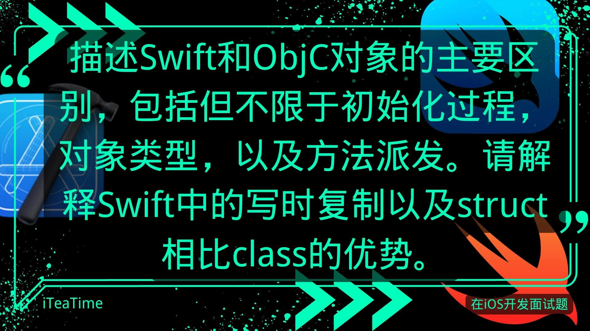

1）初始化
初始化 OC 默认置空，可以⽗类 -> ⼦类 （通过 super.init）
Swift 必须赋值，⼦类 -> ⽗类（必须给⼦类所有属性赋值，才能调⽤ super.init）
其他：
定义变量、属性、协议，两者类似。

2）Swift 对象包括 class、enum、struct
enum 和 struct 都是值引⽤ -> 可以引出问题：写时复制 / struct ⽐ class 有什么优势

3）⽅法派发
Swift 直接派发，没有 isa 那⼀段，OC 要通过 isa 查找；
[https://www.jianshu.com/p/91bfe3f11eec](https://www.jianshu.com/p/91bfe3f11eec) ，Swift 的消息派发，浓缩在下⾯的表⾥了.

runtime 之消息转发:

- 消息发送（缓存+函数表查找，往⽗类查找）
- 动态⽅法解析（动态缓存，class_addMethod 添加）
- 消息转发 （forwardingTargetForSelector / methodSignatureForSelector / doesNotRecognizeSelector）

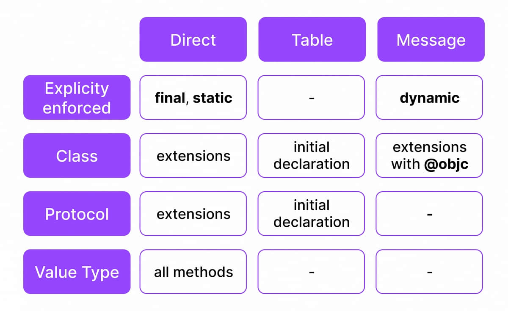


| Swift ⽅法派发  | 直接派发 Direct Dispatch  | 函数表派发 Table Dispatch | 消息机制 Message Dispatch 转化为 objc_msgSend |
| --- | --- | --- | --- |
| NSObject |  @nonobjc or final  | Initial Declaration函数内部调⽤ | Extensions dynamic |
| Class | Extensions final |   Initial Declaration 函数内部调⽤ | dynamic |
| Protocol  | Extensions |  Initial Declaration 函数内部调⽤ |  @objc |
| Value Type 值类型 |  All methods | N/A | N/A |


[https://chat.openai.com/share/5ed1d819-48e0-4755-8e8c-5d3a6d0e7db6](https://chat.openai.com/share/5ed1d819-48e0-4755-8e8c-5d3a6d0e7db6)

```swift
//请猜测打印的结果
// [2023-07-28 14:45:39] @iTeaTime(技术清谈)@ChenYilong
import UIKit

class BaseCell: UITableViewCell {
    override init(style: UITableViewCell.CellStyle, reuseIdentifier: String?) {
        super.init(style: style, reuseIdentifier: reuseIdentifier)
    }
    
    required init?(coder: NSCoder) {
        fatalError("init(coder:) has not been implemented")
    }
}

extension BaseCell: ClassIdenfifiable {
    static var reuseIdentifier: String {
        return "default"
    }
    
    static var reuseIdentifier2: String {
        return "B"
    }
}
protocol ClassIdenfifiable {
    static var reuseIdentifier: String { get }
}

extension ClassIdenfifiable {
    static var reuseIdentifier: String {
        return String(describing: self)
    }
    //不在 Protocol requirements 中声明
    static var reuseIdentifier2: String {
        return "A"
    }
}

class ViewController: UIViewController {

    override func viewDidLoad() {
        super.viewDidLoad()
        // Do any additional setup after loading the view.
        let aType: ClassIdenfifiable.Type = BaseCell.self
        print("aType.reuseIdentifier is ", aType.reuseIdentifier)
        print("aType.reuseIdentifier2 is ", aType.reuseIdentifier2)
        
        print("BaseCell.reuseIdentifier is ", BaseCell.reuseIdentifier)
        print("BaseCell.reuseIdentifier2 is ", BaseCell.reuseIdentifier2)
    }
    
}
```

协议声明的方法是一定有正确的行为的.所以无论是什么什么方式调用，id一定是default, 不对你可以找苹果. 至于id2， 其实是ub的, undefined behavior 换句话来说，你可以用 静态派发 来解释这个行为，但不能假定他一定会静态派发

这就是为什么我说他是ub的，因为swift的团队都不知道怎么处理

[](https://github.com/apple/swift/blob/main/docs/GenericsManifesto.md#maybe)

考察的是Swift方法派发

[](https://github.com/apple/swift/blob/main/docs/GenericsManifesto.md#dynamic-dispatch-for-members-of-protocol-extensions)

| 区别 | 派发行为 | 别称 |
| --- | --- | --- |
| Protocol Default Implementation | Dynamic Dispatch | Table Dispatch |
| 普通 Extension | Static Dispatch | Direct Dispatch |

细节：
1」 Swift  协议和类的 extension ⾥的⽅法使⽤直接派发，所以不能被重写；
2」NSObject 的 extension 会使⽤消息机制进⾏派发，NSObject 作⽤域内的的是函数表派发；
3」协议⾥声明的, 并且带有默认实现的函数会使⽤函数表进⾏派发；
4」消息派发通过缓存来达到跟函数表派发⼀样的效率；
5」OC 可以通过   `___**attribute__**((objc_direct))`   实现直接派发；
6」Swift 的派发在 SIL（Swift Intermediate Language）中的表现：
直接派发（Direct）：在 SIL ⽂件中，以 function_ref 的⽅式获取函数；
函数表派发（Table）：在 SIL ⽂件中，以 class_method 的⽅式，通过 Vtable 获取函数；
消息转发（Message）：在 SIL ⽂件中，以  objc_method 的⽅式获取函数；
协议表调度（witness_method）：实现了协议的 Swift 类，通过 PWT 找到 Vtable 进⾏调度；
7」函数表派发的 Vtable 存在 metaData 中；

// ClassIdenfifiable is Existential type

 **let** cell: ClassIdenfifiable = BaseCell()

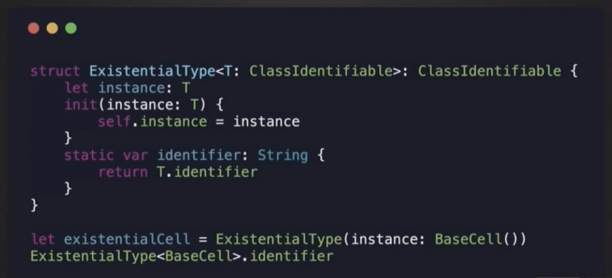


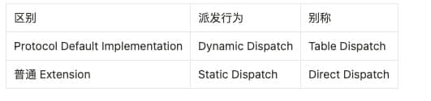


### **43. What is polymorphism?**

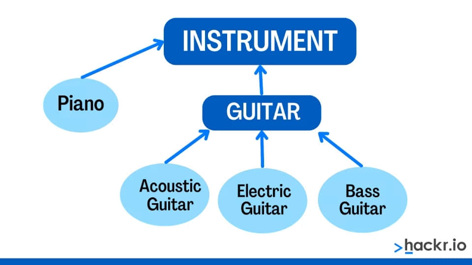


Polymorphism is an essential building block of any object-oriented programming language. It uses a single symbol to represent many different kinds of entities or the availability of a single interface to entities of diverse types. With polymorphism, your code can operate on either the parent class or one of its offspring, depending on the supported hierarchy (family of objects).

## 5、不通过继承，代码复⽤ / 共享的⽅式有哪些？

1）swift ⽂件⾥的⽅法在包⾥ public / open 相当于全局函数；
2）通过 protocol + protocol 的拓展默认实现，实现这个 protocol 就可以拥有这些代码的能⼒；

## 父类的分类中写了一个方法, 子类能否直接调用。告知原因。

| 调用演示 | 类别 | 注意事项 |
| --- | --- | --- |
| [self cyl_test]; | 分类实例方法 | 必须在子类中手动 import 父类的分类,否则抛 编译错误❌ |
| [self performSelector:@selector(cyl_test)]; | 分类实例方法 | 必须在子类中手动 import 父类的分类,否则抛 warning⚠️ |
| [[self class] cyl_testClass]; | 分类类方法 | 必须在子类中手动 import 父类的分类,否则编译错误 ❌ |
| [[self class]performSelector:@selector(cyl_testClass)]; | 分类类方法 | 必须在子类中手动 import 父类的分类,否则抛 warning⚠️ |

## **面向协议编程：**

What is a protocol and how can we benefit from it?


**What is protocol extension? Why Swift called as Protocol Oriented Language?**

[What is protocol extension? Why Swift called as Protocol Oriented Language?](https://www.iosiqa.com/2020/04/what-is-protocol-extension-why-swift.html)

1. 
2. 

## 6. Can we add a property in a protocol? Can we put property in the protocol in Swift?

**What is protocol extension? Why Swift called as Protocol Oriented Language?

[https://chat.openai.com/share/5ed1d819-48e0-4755-8e8c-5d3a6d0e7db6](https://chat.openai.com/share/5ed1d819-48e0-4755-8e8c-5d3a6d0e7db6)

[What is protocol extension? Why Swift called as Protocol Oriented Language?](https://www.iosiqa.com/2020/04/what-is-protocol-extension-why-swift.html)

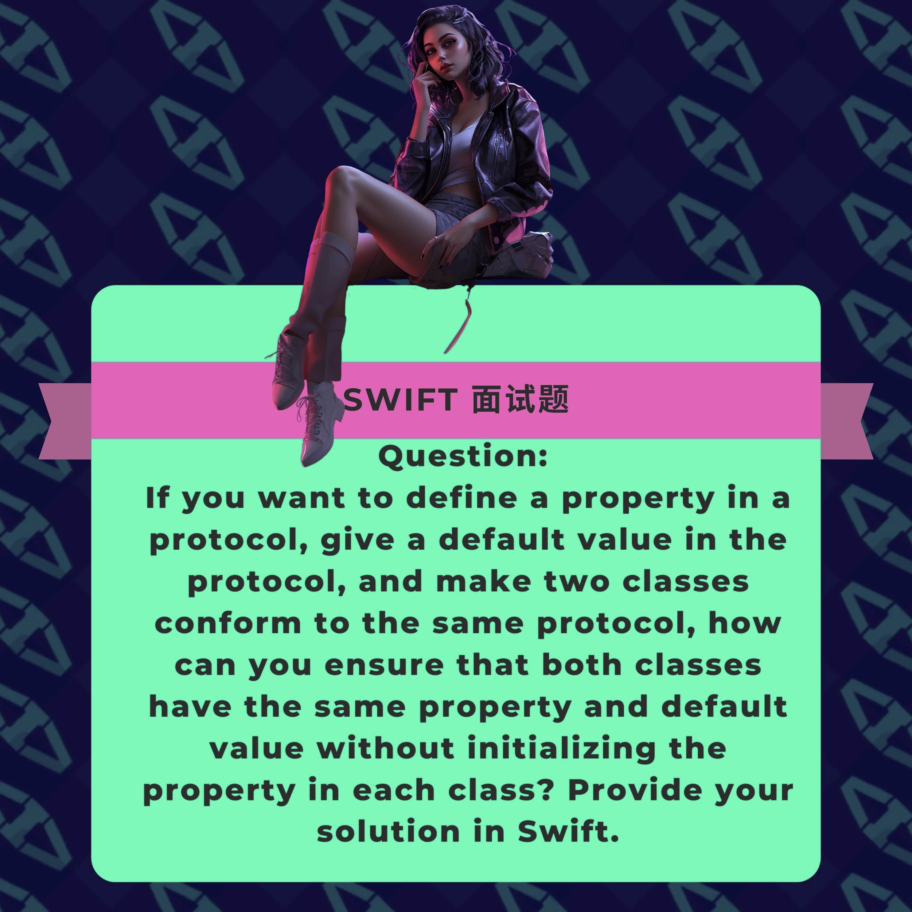
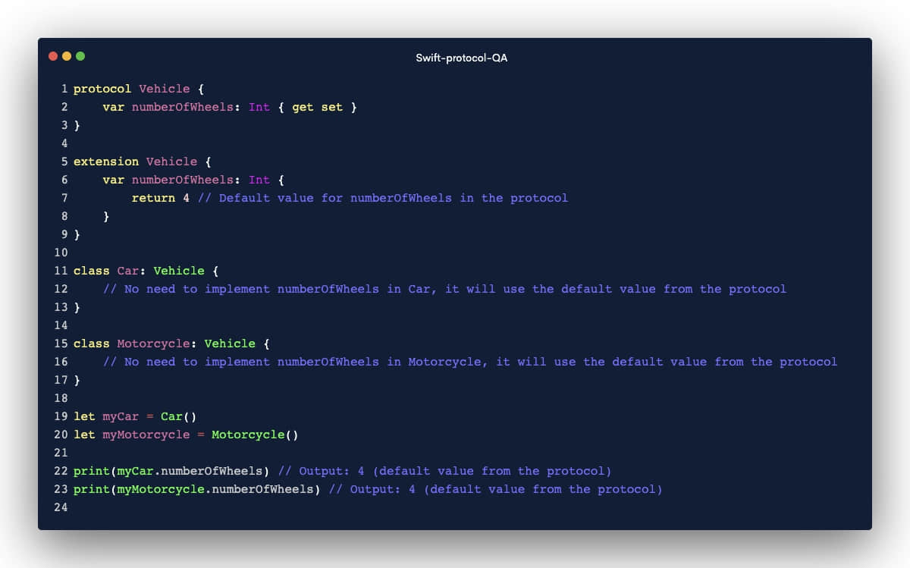


## 2、Swift 的协议和 OC 的协议有什么区别


1）OC 的协议⽤来实现代理；

2）Swift 协议定义了适合特定任务或功能的⽅法，属性。协议可以由类，结构或枚举实现，任何类型实现协议的要求
⽅法称为遵守协议（⾯向协议、接⼝编程）；
1」协议后加 : AnyObject 可以让协议只能被 Class 实现；
2」使⽤类的拓展可以让现有的类实现协议；
3」使⽤协议的拓展，可以让协议有默认实现；
4」类似 OC 的 @optional 实现（对于 3」的应⽤）
推荐在 protocol 的 extension ⾥实现默认⽅法，这样就不必写这个⽅法的实现了。
混编的可以 @objc；

3）⾯向协议编程与⾯向对象编程相⽐有什么优缺点？
⾯向协议：可以实现多继承、代码量少，不会污染，代码耦合性低 ；缺点：可读性低

4）常⽤协议：

OptionSet , 实现该协议可以实现 [.a, .b, .c] 这样的枚举集合，类似 C 语⾔ enum 的按位枚举；
Equatable，实现协议可以使⽤ !=、== , 与之相似的还有 Comparable；
Codable，（混合了 Decodable 和 Encodable），encode / init decode ⽅法；
1」实现了 Codable , 就可以⽤系统的 JSONEncoder().encode ⽅法；
2」处理 空值，⽤可选把 null 转换成 nil；
3」处理 ⽅法属性名映射，重写 enum:  private enum CodingKeys: String, CodingKey {
case abc = “a_b_c"
}；
4」处理 系统类，如 CLLocationCoordinate2D，在 extension 中实现 Codable；
Sequence / IteratorProtocol，实现了可以使⽤ for … in ，类似链表结构，IteratorProtocol 中包含 next() ⽅法，和
currentIndex ⽅法；（下⽂ Sequence 部分有更详细的说明）
Collection：
在 Sequence 的基础上，实现了下标⽅法 Index，遵守 Comparable 协议；
IndexingIterator，类似 IteratorProtocol；
（下⽂ Sequence 部分有更详细的说明）

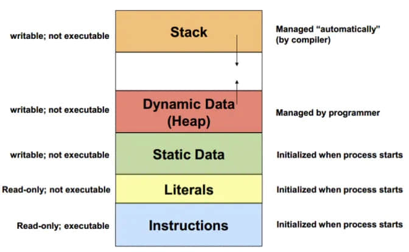


## **闭包：**

## Closure in Swift

 
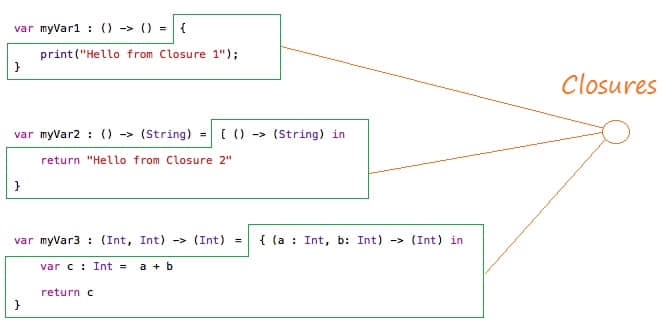


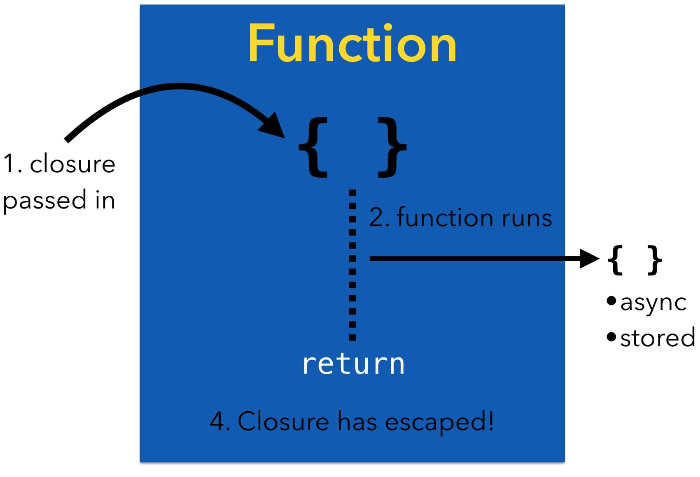


## Swift 的闭包（Closure） 和 OC 的 Block
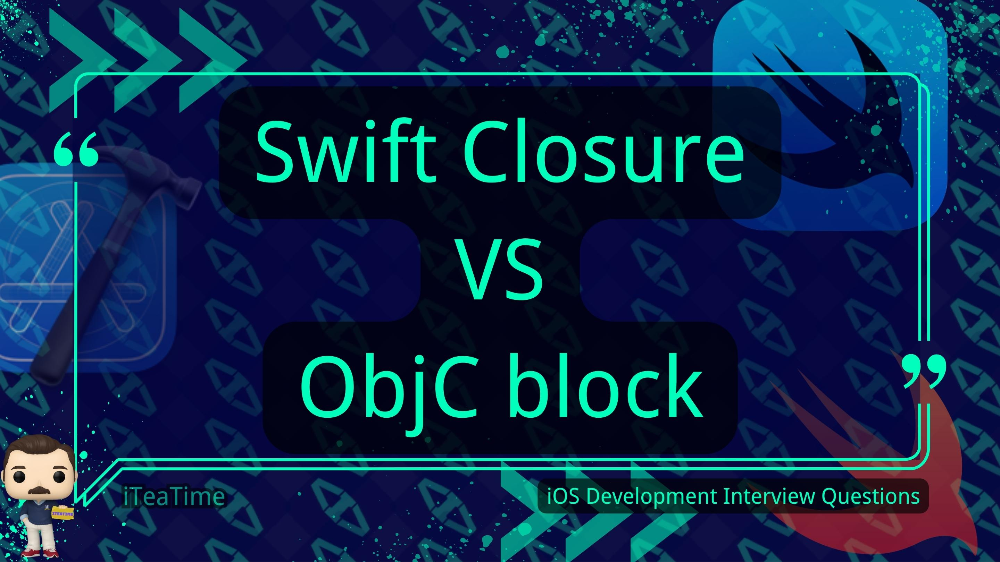

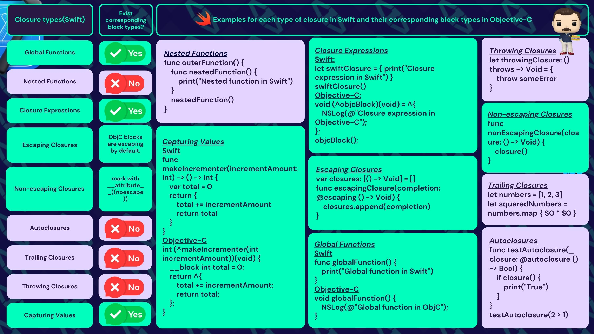

本质上 OC 的 block 就是⼀个结构体，然后这个结构体⾥⾯有⼀个结构体成员专⻔⽤来保存捕捉对象，因此才会导致
被 block 捕捉引⽤ +1  ，或者说 block 是⼀个带有⾃动变量（局部变量）的匿名函数。
Block 的原理及其内存管理
Swift 的闭包：（闭包是⼀个捕获了全局上下⽂的常量或者变量的函数）
1、捕获值原理：在堆上开辟内存空间，并将捕获的值放到这个内存空间⾥
2、修改捕获值时：实质是修改堆空间的值
3、闭包是⼀个引⽤类型（引⽤类型是地址传递），闭包的底层结构（是结构体：函数地址 + 捕获变量的地址 == 闭包）
4、函数也是⼀个引⽤类型（本质是⼀个结构体，其中只保存了函数的地址）

参考: [《Swift-进阶 09：闭包（⼀）使⽤&捕获原理》](https://www.jianshu.com/p/299a9a5c5cd1) 

先看个经典的闭包优化

```swift
results = OKRs.filter({ (s1: Int) -> Bool in
      return s1 > 90
}) //正常闭包

results = OKRs.filter({ s1 in return s1 > 90 }) //类型推断
results = OKRs.filter({ s1 in s1 > 90 }) //默认返回值
results = OKRs.filter({ $0 > 90 }) //参数替换
results = OKRs.filter{ $0 > 90 } //尾随闭包
results = OKRs.filter( $0 > 90 ) //⾃动闭包 @autoclosure // @autoclosure 会把 $0 > 90 的表达式⾃动转换成 () -> T
//a ？？b 中 b 的实现也是转换成了⼀个⾃动闭包 () -> T

```

swift 闭包的优化，就是上⾯的代码
1.根据上下⽂推断参数和返回值类型
2.从单⾏表达式闭包中隐式返回（也就是闭包体只有⼀⾏代码，可以省略return）
3.可以使⽤简化参数名，如$0, $1(从0开始，表示第i个参数...)
4.提供了尾随闭包语法(Trailing closure syntax)

闭包捕获值：
闭包可以在其定义的上下⽂中捕获常量或变量。
即使定义这些常量和变量的原域已经不存在，闭包仍然可以在闭包函数体内引⽤和修改这些值。
Swift最简单的闭包形式是嵌套函数，也就是定义在其他函数的函数体内的函数。
嵌套函数可以捕获其外部函数所有的参数以及定义的常量和变量。

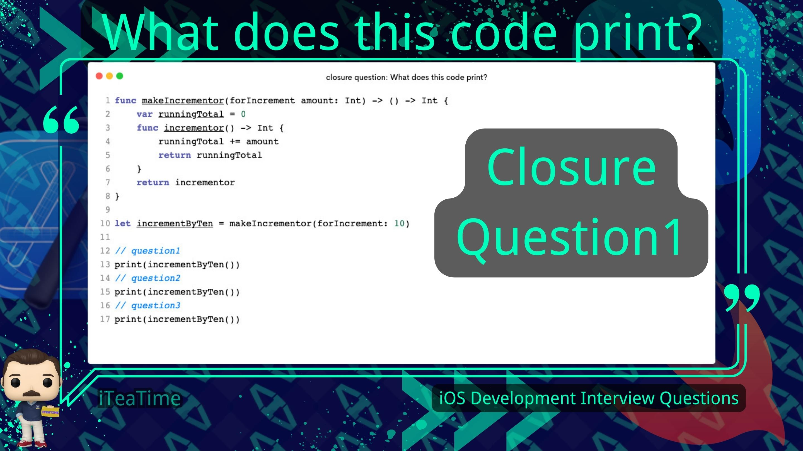

```swift
//这个例⼦就是 嵌套函数 incrementor() 的本质是闭包， 闭包捕获了 runningTotal 值，存储了起来，
所以每次调⽤都会 + 10
func makeIncrementor(forIncrement amount: Int) -> () -> Int {
    var runningTotal = 0
    func incrementor() -> Int {
        runningTotal += amount
        return runningTotal
    }
    return incrementor
}

let incrementByTen = makeIncrementor(forIncrement: 10)

// 返回的值为10
print(incrementByTen())
// 返回的值为20
print(incrementByTen())
// 返回的值为30
print(incrementByTen())

```

扩展:

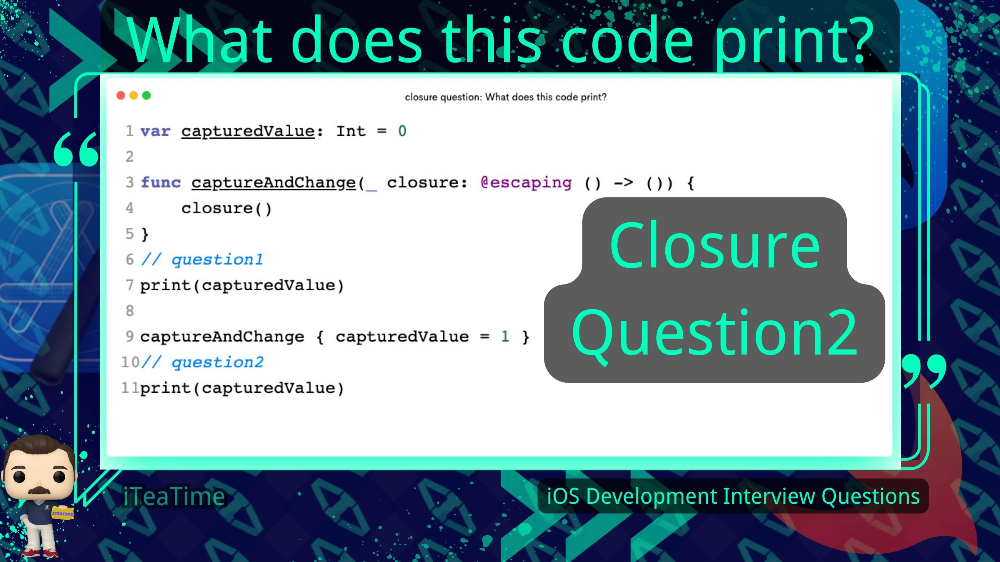
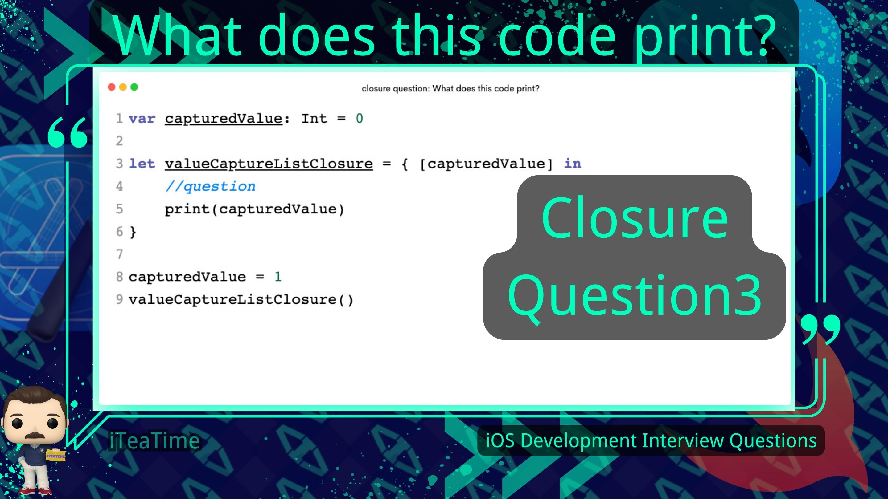
## **可选类型：**

## What is optionals?

optional == wrapped 包

when use  optional == unwrapped 解包
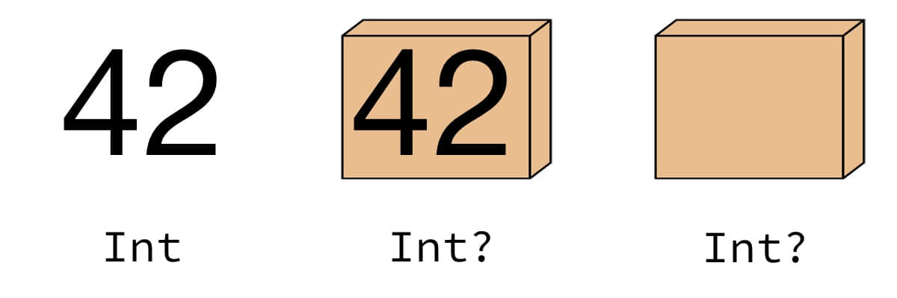


[Difference between optional values in swift?](https://stackoverflow.com/a/29054155/3395008)
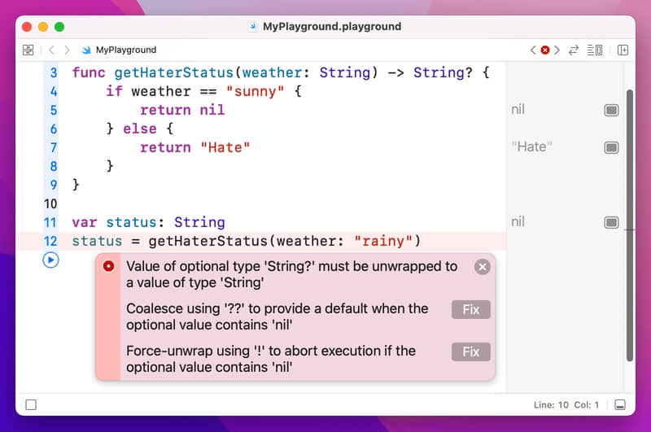


Swift 5.7 introduces a new, more concise way to unwrap optional values using `if let` and `guard let` statements. Before, we always had to explicitly name each unwrapped value, for example like this:

[Swift 5.7’s new optional unwrapping syntax | Swift by Sundell](https://www.swiftbysundell.com/articles/swifts-new-shorthand-optional-unwrapping-syntax/)


1. 4. What is the difference between if let and guard let?

## *8、Optional（可选型） 是⽤什么实现的*

*使⽤枚举（enum）的关联值 特性实现的。
1）枚举的关联值和原始值：
原始值： 就是 rawValue
关联值：类似与下⽂ Optional some 的⽤法，可以根据不同枚举类型创建不同的枚举。Alamofire 的回调也是这么⽤的。
2）Optional 源码：*

```swift
*1"//使⽤枚举，Wrapped 的英⽂是 使""...包裹的意思
2enum Optional<Wrapped> {
3  case none
4  case some(Wrapped)
5}
6
7"//这是个语法糖，下⾯两种形式等价：
8var name: Optional<String>
9var name: String?*

```

*1） ! 或者 ？拆包  
所谓的 nil 就是 Optional.None 
使⽤的时候后需要使⽤ ! 来从 enum ⾥进⾏拆包 
！⽤来求取 Optional.Some(T) 包装下的值，所以为 Optional 值 = nil 时会报错； -> 这⾥可以引出泛型相关问题*

*2） 可选链
a?.b?.c，如果前⾯的为 nil 了则结果直接为 nil；*

*3）?? 来表示默认值
4）除了 ! / ？ 拆包，还有 if let 可选绑定、隐式解析（a！= xxxx）两种处理 Optional 的形式；*

#### 4. How to unwrap optionals in Swift?
https://www.hackingwithswift.com/sixty/10/2/unwrapping-optionals


## *lazy load 是怎么实现的？*
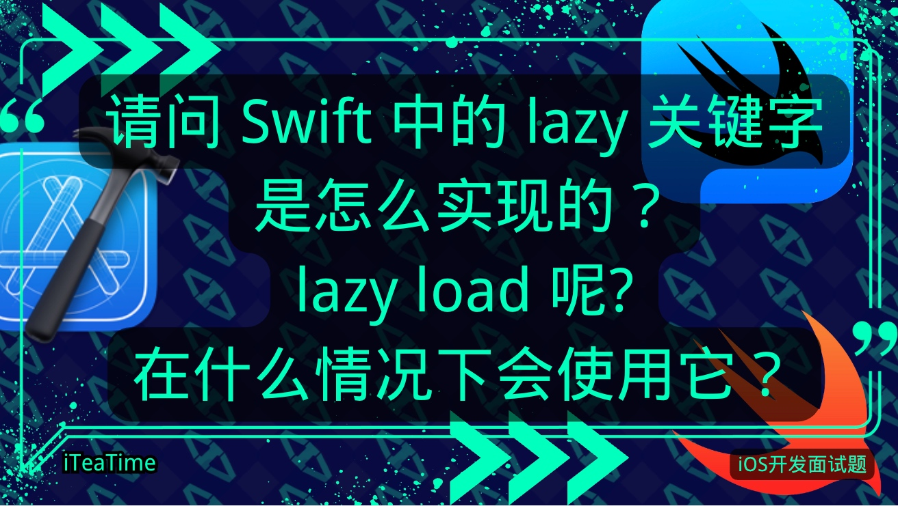

请解释 Swift 中的 lazy 关键字是怎么实现的？在什么情况下会使用它？

*Swift 的 lazy 分：

1」lazy 修饰属性（⻅上⼀条）；
2」lazy 修饰⽅法（⻅上⼀条）；
3」collection 中的 lazy：
把 Sequence 替换成了 个 LazySequence（实现 SequenceWrapper 接⼝）；
SequenceWrapper 保存了原始序列和变换（transform）；
LazySequence  的 Interator 在 next() ⽅法中，实现了延迟调⽤变换（transform）；*


------

<p align="center"><a href="https://github.com/ChenYilong/iOSInterviewQuestions/blob/master/02_Swift_interview_questions/practical.md"></a></p>
