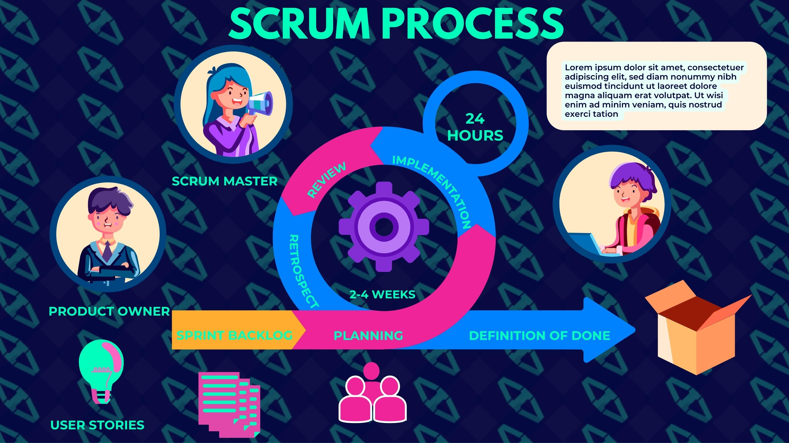
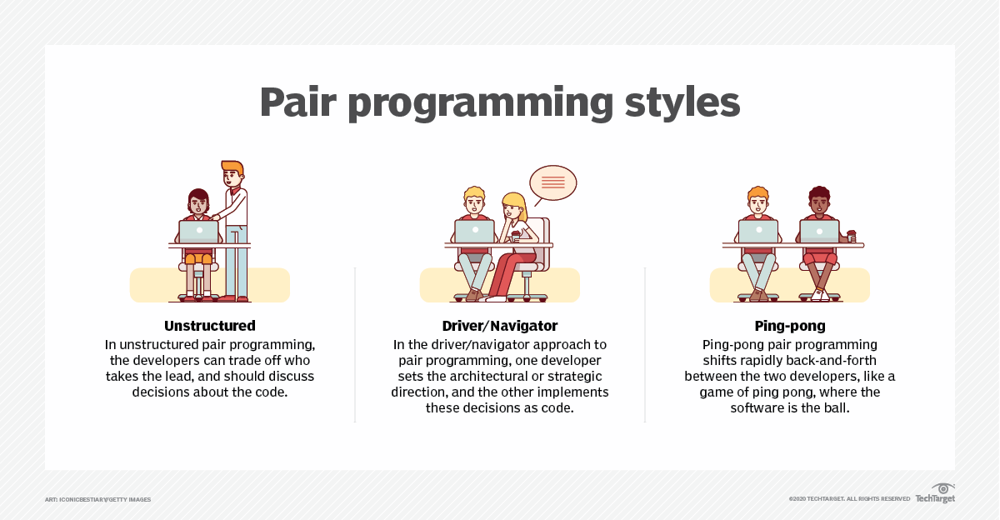
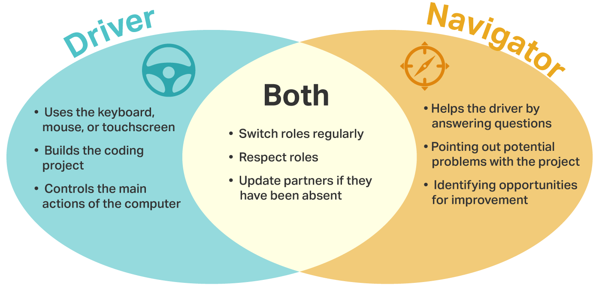

## 软件工程

**行为面试相关：**

1. How do you keep up to date with your Swift and iOS knowledge?

### STAR answer format
STAR stands for: 

* Situation – What was the situation you / your previous employer faced?
* Task – What tasks were involved in that situation?
* Action – What actions did you take?
* Results – What were the results of those actions?

### Agile Development
#### 1. Describe the project workflow in your previous career.
#### 2. Describe how to use data to drive development.
#### 3. How do you assure the code quality?
https://github.com/wheelo/Reducing-WTFs-Per-Minute
 
#### 4. How did you review code in your previous company?
https://www.morling.dev/blog/the-code-review-pyramid/

https://google.github.io/eng-practices/review/reviewer/

#### 5. If you get an emergency task now, how do you deal with it?

#### 6. State some of the Agile quality strategies.

#### 7. Do you know about Agile Manifesto & Principles? Explain in brief.

#### 8. Is there any drawback of the Agile model? If yes, explain.

#### 9. What is the use of burn-up and burn-down charts?

#### 10. Define Zero Sprint and Spike in Agile.

### Scrum Development

#### 1. What is the duration of a scrum sprint?

#### 2. What is Velocity?

#### 3. What do you know about impediments in Scrum? Give some examples of impediments.

#### 4. What is the difference and similarity between Agile and Scrum?

#### 5. What is the increment? Explain.

#### 6. What is the "build-breaker"?

#### 7. What do you understand by Daily Stand-Up?

#### 8. What do you about Scrum ban?

### Working Method

#### 1. How do you work with pair programming?

ping pong mode: one writes test code, and the other one implements. 
https://www.codecademy.com/article/tdd-red-green-refactor

https://medium.com/@tunkhine126/red-green-refactor-42b5b643b506

### Questions for the interviewer
#### 1. How many percent of the automated test cover your project?
#### 2. How often is the review period?
