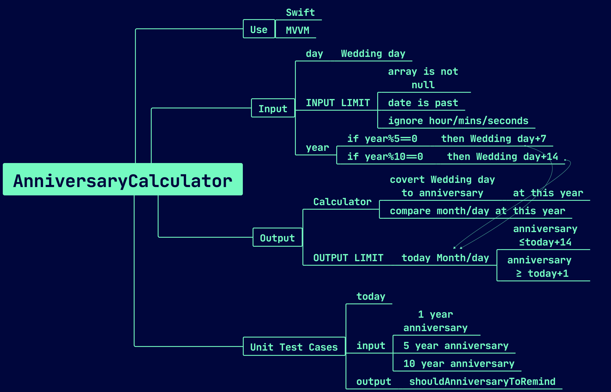

# iOS Tech Assessment

The Tech Interview question :

You're welcome to use any programming language (preferably Swift) or tools (preferably Xcode) you wish and you may look up any online resources or references as needed. Unit tests are welcome but optional.

The details of the test are below. If anything is unclear, don't hesitate to contact us and ask questions.

***You are given an array of records, each representing a couple. Each record contains the following information:***

***the couple ID, as a string***

***the couple’s wedding date, as a string in ISO format (can be null / missing)***

***Please write a function that, given an array of couple records, creates an array of wedding anniversary reminder records.***

***Each anniversary reminder record should contain the following information:***

***the couple ID, as a string***

***the next wedding anniversary date, as a string in ISO format***

***The function should only create a reminder record for a couple if the next wedding anniversary date is any day within the next 2 weeks.***

***Additionally, anniversaries celebrating a multiple of 5 years should be sent a reminder 1 week earlier than the normal case. Finally, anniversaries that are a multiple of 10 years should be sent a reminder 2 weeks earlier than the normal case.***



## INPUT LIMIT

- array is not null
- date is past
- ~~overyear?~~

## out limit:

output:

- if year%5==0 then day+7
- if year%10==0 then day+14

## Unit Test Cases

 

today is [2022-08-15 08:45:02]

input / output:

```jsx
[
{"coupleId":"1", "anniversary": "2021-8-16T10:21+0800"},
{"coupleId":"2", "anniversary": "2021-8-29T10:21+0800"},
{"coupleId":"3", "anniversary": "2017-8-08T10:21+0800"},
{"coupleId":"4", "anniversary": "2017-8-22T10:21+0800"},
{"coupleId":"5", "anniversary": "2012-8-01T10:21+0800"},
{"coupleId":"6", "anniversary": "2012-8-15T10:21+0800"}
]
```

in 14 days input / output

anniversary -1/-14 = today[2022-08-15 09:16:45]

 today ≥ anniversary -14 && today ≤ anniversary -1 

✅ anniversary ≤today+14  && anniversary  ≥ today+1 

```jsx
[
{"coupleId":"1", "anniversary": "2021-8-16T10:21+0800"},
{"coupleId":"2", "anniversary": "2021-8-29T10:21+0800"},
]
```

5 years: input / output

✅anniversary = anniversary +7 

anniversary -1/-14 = today[2022-08-15 09:16:45]

```jsx
[
{"coupleId":"3", "anniversary": "2017-8-08T10:21+0800"},
{"coupleId":"4", "anniversary": "2017-8-22T10:21+0800"},
]
```

10 years: input / output

✅anniversary = anniversary +14 

anniversary -1/-14 = today[2022-08-15 09:16:45]

```jsx

[
{"coupleId":"5", "anniversary": "2012-8-01T10:21+0800"},
{"coupleId":"6", "anniversary": "2012-8-15T10:21+0800"}
]
```