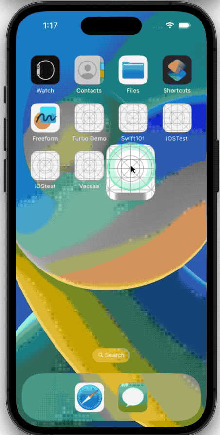

# iOSTest
Source code: [Swift Demo]( https://github.com/ChenYilong/iOSInterviewQuestions/blob/master/Swift/MVVMDemo "") 

## Task DETAILS  

Your task is to create a native iOS app.  
Use the endpoints at https://jsonplaceholder.typicode.com  
Display posts in a list.  
Open a detailed view with associated comments when user selects an item on the posts list.  

### Nice to have:  

Search functionality on the posts list and comments list.  

## Result from Yilong Chen 

 Below is a summary of the tasks I undertook, and the functionalities I implemented as part of this assignment:

1. **Native iOS App Creation**: I developed a native iOS app using Swift and MVVM, following best practices and clean code principles.

2. **API Integration**: Integrated the app with the API endpoints provided at https://jsonplaceholder.typicode.com. I effectively fetched data from the API and handled possible errors.

3. **Displaying Posts**: I created a UI that lists all posts retrieved from the API endpoint. Each post displays the necessary information as required.

4. **Detailed View**: Implemented a detailed view which gets triggered when a user selects an item from the posts list. This view showcases the associated comments for the selected post.

5. **Search Functionality**: As an additional feature, I implemented search functionality on both the posts list and the comments list. This allows users to easily find specific posts or comments by typing in search keywords.

6. **Unit Testing**: Finally, I added comprehensive unit test cases to ensure the correct behavior of the implemented functionalities. This resulted in achieving 78.3% code coverage, thereby validating the reliability and performance of the app.
