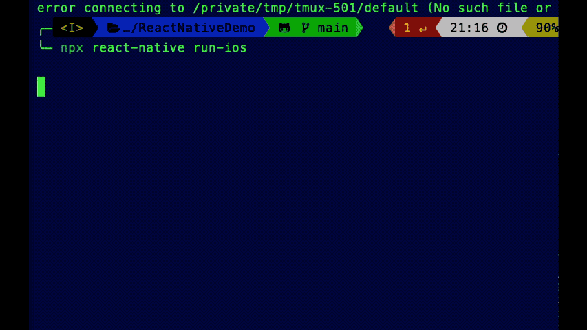

## Question

# ReactNativeDemo

You are asked to write an iOS SDK and an React Native App that uses the SDK.

The SDK should expose a method that generates a random color in either hex or RGB, for example, if you use hex, the random color is a value between #000000 and #FFFFFF.

When the app is initialized it should show an empty white screen. When the user taps on the screen, the app should use the iOS SDK to get a random color value, and change the color of the empty screen with that color.

The completed project should be delivered in a format we can review, such as a github repository.


## Answer




 ```shell
cd ReactNativeDemo
npm start
npx react-native run-ios


 ```

or 


 ```shell
npx expo run:ios
 ```

